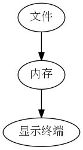

## 文件加载到显示的过程

只要是用过linux的人都应该遇到过乱码的问题，众所周知，乱码的产生的主要原因是编
码的问题，以B编码方式去读取以A编码方式编码的文件时就会产生乱码，文件读取到显示
的过程可以简单的用下图表表示：



  - 第一步是将文件读入内存，这一步可以看作是直接将文件的二进制形式的表示直接复制 进内存，就是将你用十六进制工具看到的那些东西复制进内存，
  - 第二步是显示终端将内存中的数据以某种编码方式解码显示出来

## linux乱码产生的原因

在linux下显示终端的默认编码方式一般是utf8，而中文windows产生的文件默认编码则
是gb2312，linux首先读取文件到内存,这时内存中的数据是对原始消息使用gb2312编码
得到的,然后显示终端使用utf8解码这些信息,所以自然就无法得到正确的原始信息,也 就是产生了乱码.

## 如何避免乱码

从上面的讨论可以看出，在linux下要不产生乱码，必须让内存中的二进制数据是对原
始信息通过utf8编码得到的，那么如何保证这一点呢，有两种方式，一种是让文件本身
是utf8编码的，这样读入内存后在以utf8解码后得到的信息肯定一样，也就是不会有乱
码，第二种是直接在内存中转换，假设我读一个以gb2312编码的文件，在内存中得到一
个缓冲区buf，如果你直接将buf传送给显示终端的话，那么显示终端就会以utf8对buf
的二进制数据解码，那么就会产生乱码，因为buf的二进制数据是以gb2312对原始信息
编码得到的，那么我要正常显示，则必须将buf中的二进制数据转换为将原始信息以 utf8编码得到的二进制信息，这里分两种情况讨论:

1.  文本文件的编码格式是utf8，这种情况可以直接用c语言读取显示，不会产生乱码， 所以不过多赘述

2.  文本文件的编码是gb2312，那么直接用C语言操作时就会产生乱码，这种情况的解决方
    式主要有两种，第一种就是运行程序之前将要操作的文本文件转换为utf8，打开shell，
    输入以下命令:
    
    `iconv -f gb2312 -t utf8 youfile -c -o newfile`

其中youfile是要转换的文件，newfile就是得到的utf8编码的文件，其中c这个参数建议加上，
它可以忽略无效的字符，比如可以忽略utf8文件里的BOM，下面贴一段转换歌词编码的脚本给大
家参考:

``` bash numberLines
#!/bin/bash
for i in *.lrc
do
    is_utf8=$(file "$i" | grep 'UTF-8')
    if [ -z "$is_utf8" ]
    then
        iconv -f gb2312 -t utf8 "$i" -c -o tmp_lrc && rm -f "$i"
        mv tmp_lrc "$i"
    else
        continue;
    fi
done
```

功能就是将一个目录里扩展名为lrc的文件编码转换为utf8

这种方式有个弊端就是文件必须提前转换编码，如果程序是给别人使用，我们不可能要求别
人先将文件的编码转换好在运行程序，那么有没有什么办法可以直接在C程序里进行转换呢？
下面就看看如何在程序中进行转换，先看代码:

``` c numberLines
#include<stdio.h>
#include<iconv.h>

#define MAXLINE 1024
int main()
{
    FILE *fp = fopen("she.lrc","r");

    char buf[MAXLINE];
    char dest[MAXLINE];
    char *in = buf;
    char *out = dest;
    fgets(buf,MAXLINE,fp);

    iconv_t cd = iconv_open("UTF-8","GBK");
    int lenght = MAXLINE;
    iconv(cd,&in,&lenght,&out,&lenght)
    iconv_close(cd);
    fputs(dest,stdout);
    printf("\n");
    return 0;
}
```

上面的程序只是为了测试，所以有些错误处理代码去掉了，其中she.lrc是一个以gb2312编码
的歌词文件，用到了3个函数，icon\_open,iconv,icon\_close,这三个函数是libiconv库的接
口，这三个函数的详细介绍清参考:

  - [ICONV\_OPEN](http://www.gnu.org/savannah-checkouts/gnu/libiconv/documentation/libiconv-1.13/iconv_open.3.html)
  - [ICONV](http://www.gnu.org/savannah-checkouts/gnu/libiconv/documentation/libiconv-1.13/iconv.3.html)
  - [ICONV\_CLOSE](http://www.gnu.org/savannah-checkouts/gnu/libiconv/documentation/libiconv-1.13/iconv_close.3.html)

这三个函数的帮助文档也可以直接man，很详细，使用的顺序也是先调
用iconv\_open创建描述符，然后调用iconv转换，最后调用iconv\_close
关闭描述符，函数原型为：

``` c numberLines
iconv_t iconv_open(const char *tocode, const char *fromcode)
size_t iconv(iconv_t cd,
                    char **inbuf, size_t *inbytesleft,
                    char **outbuf, size_t *outbytesleft);
 int iconv_close(iconv_t cd);
```

其中fromcode和tocode是编码方式，shell下输入iconv –list会列出支持的编码方式。
