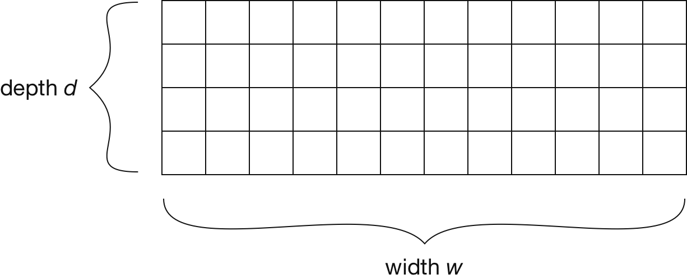
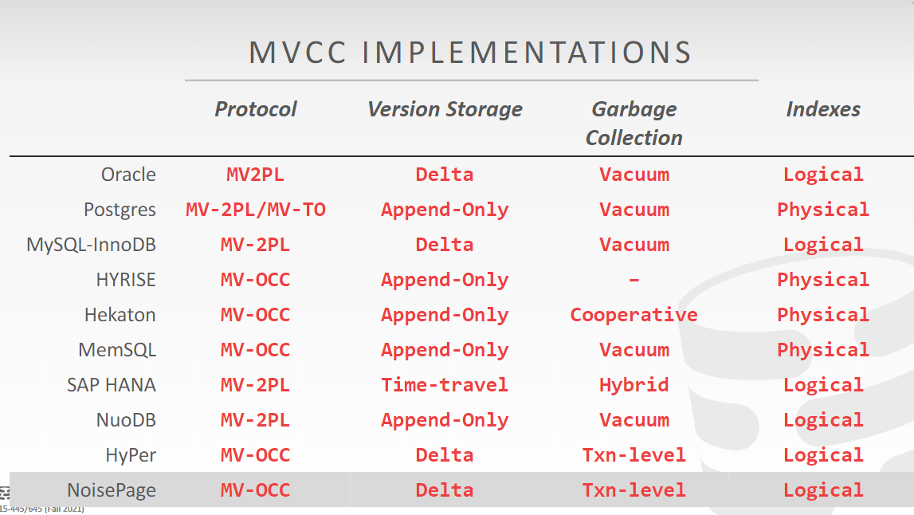
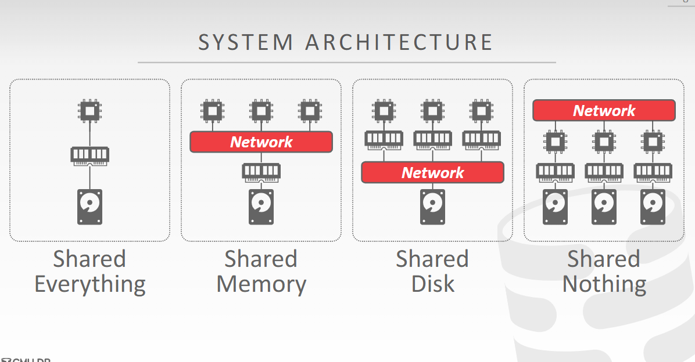

# Query Execution
## Processing Models

1. Iterator Model also known as Valcona Model or Pipeline. this model iterate over every tuple
2. Materialization Model
3. Vectorization Model: this model iterate over every batch

## Access Methods

1. Seq Scan
2. Index Scan

## Expression Evaluation
The DBMS represents WHERE clause as an expression tree.
# Query Planning & Optimization
## Logical Query Optimization

1. Split Conjunctive Predicates
2. Predicate Pushdown
3. Replace Cartesian Products with Joins
4. Projection Pushdown

## Physical Query Optimization
### Histogram

1. Count-Min Sketch:  a probabilistic data structure that serves as a frequency table of events in a stream of data. 
   
   + Initialization: $\forall i \in \{1, \dots, d\}, j \in \{1, \dots, w\}, : \operatorname{count}[i, j] = 0$
   + Increment count (of element $a$): $\forall i \in \{1, \dots, d\}: \operatorname{count}[i, h_i(a)] \mathrel{+}= 1$
   + Retrieve count (of element $a$): $min_{i=1}^d \operatorname{count}[i, h_i(a)]$

2. HyperLogLog: an algorithm for the count-distinct problem, approximating the number of distinct elements in a multiset.

### Sampling
1. Reservoir Sampling
    ```
    int[] reservoir = new int[m];

    // init
    for (int i = 0; i < reservoir.length; i++)
    {
        reservoir[i] = dataStream[i];
    }

    for (int i = m; i < dataStream.length; i++)
    {
        // 随机获得一个[0, i]内的随机整数
        int d = rand.nextInt(i + 1);
        // 如果随机整数落在[0, m-1]范围内，则替换蓄水池中的元素
        if (d < m)
        {
            reservoir[d] = dataStream[i];
        }
    }
    ```
# Concurrency Control
## Pessimistic Lock
## Optimistic Lock
## MVCC
MVCC can work with **Optimistic Lock** and **Pessimistic Lock**



# Distribute Database 




# Crash Recovery