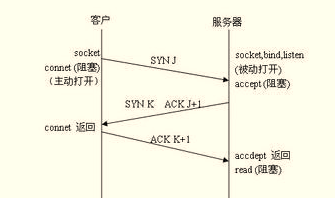
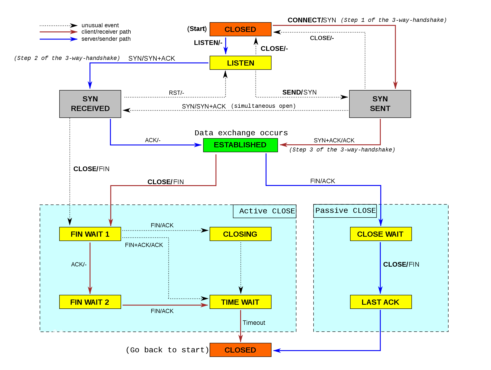

# IP

## Pcket Structure

``` example
 0                   1                   2                   3
 0 1 2 3 4 5 6 7 8 9 0 1 2 3 4 5 6 7 8 9 0 1 2 3 4 5 6 7 8 9 0 1
+-+-+-+-+-+-+-+-+-+-+-+-+-+-+-+-+-+-+-+-+-+-+-+-+-+-+-+-+-+-+-+-+
|Version|  IHL  |Type of Service|          Total Length         |
+-+-+-+-+-+-+-+-+-+-+-+-+-+-+-+-+-+-+-+-+-+-+-+-+-+-+-+-+-+-+-+-+
|         Identification        |Flags|      Fragment Offset    |
+-+-+-+-+-+-+-+-+-+-+-+-+-+-+-+-+-+-+-+-+-+-+-+-+-+-+-+-+-+-+-+-+
|  Time to Live |    Protocol   |         Header Checksum       |
+-+-+-+-+-+-+-+-+-+-+-+-+-+-+-+-+-+-+-+-+-+-+-+-+-+-+-+-+-+-+-+-+
|                       Source Address                          |
+-+-+-+-+-+-+-+-+-+-+-+-+-+-+-+-+-+-+-+-+-+-+-+-+-+-+-+-+-+-+-+-+
|                    Destination Address                        |
+-+-+-+-+-+-+-+-+-+-+-+-+-+-+-+-+-+-+-+-+-+-+-+-+-+-+-+-+-+-+-+-+
|                    Options                    |    Padding    |
+-+-+-+-+-+-+-+-+-+-+-+-+-+-+-+-+-+-+-+-+-+-+-+-+-+-+-+-+-+-+-+-+

```

1.  Version:

## IP地址的分级和组成

1.  A类(0开头) 0.xx.xx.xx \~ 127.xx.xx.xx
2.  B类(10开头) 128.xx.xx.xx \~ 191.xx.xx.xx
3.  C类(110开头) 192.xx.xx.xx \~ 223.xx.xx.xx
4.  D类(1110开头) 224.xx.xx.xx \~ 239.xx.xx.xx
5.  E类(1111开头) 240.xx.xx.xx \~ 255.xx.xx.xx

为了局域网组网方便,有一部分IP是私有,也就是说带有这些ip的ip包是不会出现在公网上的,这 些ip只应该出现私有网络内部.

  - A类：10.0.0.0 - 10.255.255.255 (10.0.0.0/8)
  - B类：172.16.0.0 - 172.31.255.255 (172.16.0.0/12)
  - C类：192.168.0.0 - 192.168.255.255 (192.168.0.0/16)

loopback网段: 127.0.0.0/8

## 子网

ip地址被分为NET ID和HOST ID, 如果ip地址的NET ID相同那么就处于同一子网, 也就可以 使用链路层设备直接通信.

  - 子网掩码: 用来指定ip的哪些位是NET ID, 比如说 `255.255.255.0` 就是说IP的前24位 是NET ID,
    `255.240.0.0` 就是说前12位是NET ID. 所以 `192.168.0.0/255.255.255.0`
    实际上就是指定了一个网段, 也可以用CIDR `192.168.0.0/24`,
    后面的数字代表前24位是NET ID.

## NAT

Network Address Translation, 主要是用来自动转换IP地址, 这样一个私有网络的所有计 算机就可以共用一个public
ip来上网. 它是使用ip和port来识别包的.

## DHCP

# TCP

tcp提供的是可靠的数据传输，这意味着要满足以下几点:

1.  数据报不能损坏
2.  数据报不能丢失
3.  数据报要按照发送顺序提供给上层的调用者

为了应对这几点，引入很多机制

1.  为了应对数据报丢失和损坏，引入了 **确认** 机制，也就是ack报文。
2.  为了检测数据报损坏，所以引入了checksum
3.  为了从数据报损坏,丢失中恢复，引入 **重传** 的机制
4.  为了消除重传造成的数据报冗余，必须保证 幂等，这样就引入了 **序号** 机制, 序 号机制也可以保证数据流的顺序。

## 协议详解

tcp的头部格式

``` example
 0                   1                   2                   3
 0 1 2 3 4 5 6 7 8 9 0 1 2 3 4 5 6 7 8 9 0 1 2 3 4 5 6 7 8 9 0 1
+-+-+-+-+-+-+-+-+-+-+-+-+-+-+-+-+-+-+-+-+-+-+-+-+-+-+-+-+-+-+-+-+
|          Source Port          |       Destination Port        |
+-+-+-+-+-+-+-+-+-+-+-+-+-+-+-+-+-+-+-+-+-+-+-+-+-+-+-+-+-+-+-+-+
|                        Sequence Number                        |
+-+-+-+-+-+-+-+-+-+-+-+-+-+-+-+-+-+-+-+-+-+-+-+-+-+-+-+-+-+-+-+-+
|                    Acknowledgment Number                      |
+-+-+-+-+-+-+-+-+-+-+-+-+-+-+-+-+-+-+-+-+-+-+-+-+-+-+-+-+-+-+-+-+
|  Data |           |U|A|P|R|S|F|                               |
| Offset| Reserved  |R|C|S|S|Y|I|      Receive Window Size      |
|       |           |G|K|H|T|N|N|                               |
+-+-+-+-+-+-+-+-+-+-+-+-+-+-+-+-+-+-+-+-+-+-+-+-+-+-+-+-+-+-+-+-+
|           Checksum            |         Urgent Pointer        |
+-+-+-+-+-+-+-+-+-+-+-+-+-+-+-+-+-+-+-+-+-+-+-+-+-+-+-+-+-+-+-+-+
|                    Options                    |    Padding    |
+-+-+-+-+-+-+-+-+-+-+-+-+-+-+-+-+-+-+-+-+-+-+-+-+-+-+-+-+-+-+-+-+
|                             data                              |
+-+-+-+-+-+-+-+-+-+-+-+-+-+-+-+-+-+-+-+-+-+-+-+-+-+-+-+-+-+-+-+-+
```

**几点解释:**

1.  Source Port, Destination Port是端口号
2.  Sequence Number: tcp对内部传送的每一个字节都会编号, 该字段代表的就是该数 据报第一个字节的编号.
3.  Acknowledgment Number: 当接受端收到一个tcp数据报后,会发送一个确认报文,发
    送端就是根据确认报文来判断该数据报是否发送成功,如果长时间没有收到确认报
    文,那么发送端就会重发tcp数据报, 确认报文的ACK必须为1,同时Acknowledgment
    Number代表该端期望接受数据的序号,比如接受端收到一个tcp报文,该报文的
    Sequence Number是a, 同时报文长度是b, 那么对该报文的确认报文的 Acknowledgment
    Number字段就是a+b. **只有ACK标志为1时该字段才有效**
4.  Data Offset: 实际数据在报文中的偏移,也可以看作是tcp头部的大小,因为tcp头部
    包含options所以他的大小是可变的,这就是该字段存在的原因.
5.  标志:
      - URG: 紧急指针
      - ACK: Acknowledgement number有效
      - PSH:
      - RST: 重置连接, 万恶的GFW经常这么干.
      - SYN: Synchronize sequence numbers, 三步握手时需要.
      - FIN: finish, 关闭连接时会用到该标志
6.  Window size: 用来标示发送该数据报的一端希望接收的数据大小, 主要用来进行 流控制(flow control).

**其他说明:**

1.  TCP可以看做是一个全双工管道,可读可写, 也就是说一个tcp socket的读写是分离, 互不干扰的.
2.  TCP提供了流控制,也就是说内部有缓冲区,如果缓冲区满了那么相应的操作就会阻塞,举 个例子,
    如果接受者的读缓冲区满了,那么你在发送者一端调用write就会阻塞.

## 基本原理

1.  tcp是使用累积确认，也就是说接收端发送了一个ack=N的确认报文，那么就意味着 所有序号小于N的数据都已经成功接受。
2.  接收端只确认顺序到达的最大序号的报文，比如a,b,c,d四个报文，假设它们顺序到
    达但是b丢失，那么实际上对c,d的确认报文和对a的确认报文是一样的。一旦发送端
    收到的重复ACK报文达到一个阈值，那么就会重发b， 对b的ACK报文的ack实际上等 于d的序号加上d的长度。

## 连接管理

### 三步握手

如下图所示:  三个报文:

1.  SYN标志为1, 同时为Sequence Number指定一个初始值J
2.  SYN以及ACK标志为1,同时为Sequence Number指定一个初始值K, 同时将 Acknowledgement
    Number设为J+1.
3.  ACK标志为1, 同时将Acknowledgement Number设为K+1, FIN报文会消耗一个编号

### 连接关闭

如下图所示 

### 状态变化

如下图所示 

**TIME\_WAIT**: 关闭连接时, 执行主动关闭的一方的socket在发送了最后一个ACK后进入
TIME\_WAIT状态,并保持该状态2SML(1-4分钟), 该状态存在的原因是:

1.  如果最后一个ACK丢失,那么对方就会重发FIN报文,这时socket有机会发送ACK报文, 而不是由内核发送RST报文.
2.  可以让网络中当前连接的tcp报文全部失效,因为TCP会超时重传,所以网络可能存在
    一些没有被当前客户端接受的报文,等待2SML后这些报文就都失效了.
    如果不等待 2SML, 同时你又在相同的interface上创建了socket,那么这些上一次连接的报文就 可能被本次连接认为有效.

**处于TIME\_WAIT时,(ip, port)不可用, 所以有时重启服务器需要等一段时间.**, 当然
只有在服务器有客户端连接的情况下才会出现这种情况,因为如果这时重启服务器,那么
服务器端会执行主动关闭,所以就会进入TIME\_WAIT状态. 如果没有客户端连接,那么服 务器一般就只有一个listen
socket,关闭它不会进入TIME\_WAIT.

## 流量控制

tcp必须匹配发送方以及接收方的速率,因为接收方处理数据的速度可能没有发送方发送
数据的速度快，这时候需要降低发送方的发送速度，因为发送的再快，可是接收方处理
不了的话，那也没有任何意义。

**Notice**: 流量控制和拥塞控制不是一回事，流量控制只是为了匹配发送方，接收方的
速率和网络没关系。拥塞控制主要是根据网络的负载情况来动态的调整发送速率，来避
免网络拥塞.

tcp数据报的Receive window size就是用来告知对方自己的接收缓冲区最多还能接收多 少数据，它是通过下面的方式计算的。

``` example
lastByteRcvd - lastByteRead <= RcvBuffer
rwnd = RcvBuffer - (lastByteRcvd - lastByteRead)
```

1.  lastByteRcvd: 接收到的最大序号
2.  lastByteRead: 已经被上层处理了的最大序号
3.  rwnd: 流量窗口的大小
4.  RcvBuffer: 接收缓冲区的大小

**zero window**: 当rwnd=0的时候，发送方仍然会继续发送只包含1字节数据的数据报，
这样可以迅速的探测出对方的接收缓冲区什么时候有空间了。

## 拥塞控制

# TSL/SSL

## 数字签名

目的:

1.  确定正文内容确实来源于发送者
2.  确定正文内容没有被篡改

实现:

  - 发送者: 对正文内容hash从而生成摘要(Digest),接着用私钥加密摘要,将密文附在正文的后面
  - 接收者: 用发送者的公钥解密得到摘要,接着hash正文,比较摘要是否一致

原理: 私钥加密可以防止摘要被篡改,摘要要可以用来检查正文内容是否被篡改.

**数字签名对正文是不加密的**

## 数字证书

目的: 分发公钥, 防止公钥被篡改,这也是为什么叫public key certification 的原因

实现:

1.  CA机构会将你的公钥连同你的一些个人信息放入数字证书中,同时使用CA的私钥来进 行数字签名, 数字签名也会放入数字证书中.
    数字证书一般包含这些内容:
      - Version
      - Serial Number: 用来唯一的标示一个证书的
      - Certification Signature Algorithm: 签名算法(hash和加密)
      - Certification Signature Value: 数字签名的值
      - Issuer: 该证书的颁发机构(CA)
      - Subject: 该证书的所有者
      - Public Key: 证书所有者的公钥
      - Fingerprint: 该证书的指纹,可以看做是数字证书一个身份标示
2.  很多软件比如浏览器会有受信任的CA机构的数字证书,这些证书包含了CA的公钥,当收
    到一个数字证书时,它会读取证书的颁发者,然后用颁发者的公钥来检查数字证书的签
    名是否正常.

## https

要保证安全实际上要做的就是两件事:

1.  **确认服务器的身份**,也就是说服务器不能被冒充,杜绝中间人攻击,实现方法:
      - 通过数字证书安全的获得服务器的公钥
      - 验证服务器的私钥
2.  **所有的通信数据要加密**,这样即便数据被截获也可以保证安全，实现方法是每一个 会话都协商一个对称秘钥,
    用它来加密和解密传输的信息,之所以不直接使用RSA是因
    为开销太大，同时秘钥加密的数据可以被解密，达不到加密的要求。

**CA机构必须保证不做恶**, 因为一旦CA机构干坏事那就基本没有安全可言，CNNIC就是一 个例子，比如它可以配合gfw这样进行中间人攻击：

1.  它签发一个证书给某台服务器
2.  用GFW的dns劫持将访问google等网站的请求导向1中的服务器
3.  因为CNNIC的证书被浏览器信任，所以浏览器会高高兴兴的和1中的服务器进行https 通信，这样gfw也就可以解密你的https请求了

# DNS

1.  NS记录用来将一个subdomain授权给其它的dns server管理
2.  CNAME记录不能与其它记录共存
3.  SOA和CNAME记录对同一个name只能有一条。
4.  TXT可以指定多条记录，每一条记录内部又可以指定多条字符串。在dns包中每一个字符
    串都是1byte存放字符串的长度，接着跟着字符串的长度，字符串不需要以0结尾。
5.  DNS包中的authority section只能放NS记录

# 网络设备

1.  集线器(HUB): 工作于第二层,基本已被淘汰, 目前基本用交换机, HUB最大的问题是当它
    接收到一个数据包后,它会向所有连接到该hub的主机广播,
    这样会造成一大堆无用流量. 这主要是因为HUB内部没有交换机内部的那种MAC地址表.
2.  网桥: 也基本被淘汰. 它有两个端口，作用是可以把一个大的局域网分成两个小的局域
    网,这样可以显著的减少广播包的数量。但是每一个小的局域网内部还是需要广播，还是
    没有交换机那样点对点传播高效。
3.  交换机
      - 二层交换机: 用来将链路层数据包发给相应的主机或者网络设备, 内部有个MAC地址表,交
        换机会根据各个端口接受数据包的源MAC地址来自动的更新该表.因为这个表的存在,交
        换机不用像HUB一样广播,它可以点对点的发送,所以效率要高得多.
      - 三层交换机
      - 四层交换机
4.  路由器
5.  家用路由器：名字有误导性，实际上相当于一个交换机加上路由器以及防火墙。插在Lan
    口上的电脑以及无线连接的设备就像连在交换机上组网，同时它又是一个路由器，一边
    是局域网一边是公网,同时要用到 **NAT** ，因为需要将局域网ip转换成公网ip。

# 抓包工具

主要有tcpdump和wireshark

## Capture Filter

这是启动抓包之前需要设置的过滤器,设置后在本次抓包过程中不可更改, 格式是 wireshark, tcpdump通用

``` example
Exp       ::= AtomicExp LogicOp Exp | AtomicExp
AtomicExp ::= Protocol  Direction  Key  Value

LogicOp   ::= and | or | not | && | ! | ||

Protocol  ::= ether| fddi| tr| wlan| ip| ip6| arp| rarp| decnet| tcp | udp
Direction ::= src | dst | src or dst
Key       ::= host | net | port | portrange
```

1.  Protocol: 协议,可能的值为:ether, fddi, ip, arp, rarp, decnet, lat, sca,
    moprc, mopdl, tcp and udp, 默认是所有协议

2.  Direction: src, dst, src and dst, src or dst 默认是src or dst

3.  Key: 可以看做是某种属性名,支持的值为:host,port, net, portrange, 默认是host

4.  Value: 对应于Key的值
    
    ``` example
    portrange 10000-10020
    port 27011
    host 127.0.0.1
    net 192.168.1.0/24
    ```

5.  LogicalOperation: not, and, or, 可以用来组合多个表达式

## Didsplay Filter

通过Capture filter过滤后得到的包如果还是太多,那么可以通过display filter来过滤,只 让过滤后的包显示出来,
**wireshark专用**

``` example
Exp ::= AtomicExp LogicOp Exp | AtomicExp
AtomicExp ::= Protocol.Key1.Key2 CompOp Value

LogicOp ::= and | or | not | && | ! | ||
CompOp  ::= eq | ne | gt | lt | ge | le | == | != | < | > | <= | >=

Protocol ::= ether| fddi| tr| wlan| ip| ip6| arp| rarp| decnet| tcp | udp
```

1.  Key1, Key2 是可选的,不同的协议是不同的,常用的:
    
    ``` example
    ip.addr, ip.src, ip.dst
    tcp.port, tcp.srcport, tcp.dstport
    ```
    
    更详细就查文档
