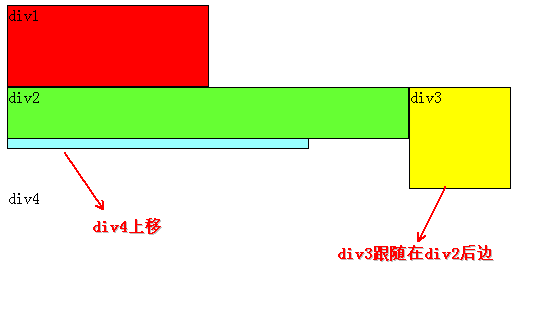

# 三种引用css的方法

``` html
<!-- 外部样式表 -->
<link rel="stylesheet" href="/static/css/your.css" type="text/css" media="screen" />
<!-- 内部样式表 -->
<style type="text/css" media="screen">
  p {
  color:red;
  font-size:12px;
  }
</style>
<!-- 行内样式表 -->
<p style="color: red; font-size: 12px;"></p>
```

# 优先级

很多时候可能有多个css规则来指定一个元素的属性,这时需要从中选出一个优先级最 高的规则(**不是后面的规则覆盖前面的规则**).

1.  \!important: 优先级最高,但不提倡使用, 如果都是或者都不是 \!important 样式那 么检查规则2.
2.  用style编写的规则(行内样式)总是优先于除1以外的其它规则, 如果都是或者都不 是行内样式那么检查规则3
3.  具有id选择符的规则必定优先于没有id选择符的规则, 如果都有id选择符, 那么id 选择符数量多的优先级高,
    如果id选择符的数量也相同那么比较规则4.
4.  具有class选择符的规则必定优先于没有class选择符的规则. 如果都有class选择 符, 那么class 选择符数量多的优先级高,
    如果class选择符的数量也相同那么比 较类型选择符和伪元素选择器.

因此在确定一个元素的css规则时就是依次检查上述1, 2, 3, 4条规则, 选出优先级最 高的css规则应用于该元素.下面举一些例子:

1.  \#content a 比 .dropdown a 的优先级高,因为前者有id选择符
2.  \#wrapper \#content 比 \#content .datepost 优先级高, 因为前者有两个id选择符.

# css selector

``` css
p {color: red;}                 /*tag selector*/
body, ul, ol {}                 /*body,ul,ol标签, 有逗号就意味着平等*/

#nav {font-size: 12px;}         /*id selector*/
.sidebar {font-family:Times}    /*class selector*/

h1#content {}                       /*id为content的h1标签*/
h1.blue{}                           /*class为blue的h1标签*/

li a {text-decoration: none;}   /*descendant selector*/
li > a{text-decoration: none;}  /*和li a 的区别是这个只选择直接子节点(ie6不支持)*/
h1 + p{font-weight: bold;}      /*h1后面的第一个p节点(h1和p应该是平级的,也就是二者是兄弟节点)*/
li #content{}                   /*li下所有id为content的标签*/
li .blue{}

a:link {color: red}             /*pseudo-class selector*/
a[title] {color: red}           /*attribute selector 所有有title属性的a节点,不支持ie6及以下浏览器*/
a[href="http://www.baidu.com"] {color:red} /*所有href属性等于http://www.baidu.com的a节点*/
a[href^="http://www.baidu.com"]{color: red;} /*所有href属性以http://www.baidu.com开头的a节点*/
a[href$=".pdf"]{color: red;} /*所有指向pdf文档的a节点*/
```

## 伪类与伪对象

伪类:

|              |                    |
| ------------ | ------------------ |
| :link        | a链接未被访问时的样式        |
| :hover       | 对象在鼠标移上时的样式        |
| :active      | 对象被用户点击以及被点击释放时的样式 |
| :visted      | a 链接被访问后的样式        |
| :focus       | 对象成为输入焦点时的样式       |
| :first-child | 对象的第一个子对象的样式       |
| :first       | 对于页面第一页使用的样式       |

标准伪对象:

|         |           |
| ------- | --------- |
| :after  | 设置对象之后的内容 |
| :before | 设置对象之前的内容 |

# css box

## 基本解释

css的盒子模型：


**注意当用width与height来设置块级元素的宽与高时,实际只是设置的content区域的宽 与高**,
margin,border,padding都是不考虑在内,所以这个宽与高不是元素实际占用的 宽与高,
这也就是margin，border，padding三个属性的含义了,这三个属性都有4个值， 比如如下代码

``` css
margin:25px 50px 75px 100px;

margin-top: 25px;
margin-right: 50px;
margin-bottom: 75px;
margin-left: 100px;
```

上述两段代码等价，指定四个值则依次为：上： 25px，右：50px，下：75px，左：100px。(T-R-B-L)
如果指定两个值，那么第一个是上下，第二个为左右，比如

``` css
margin: 0px auto;
```

那么上下是0px，左右会相等，也就是居中效果

## margin的负值

这三个属性只有margin可以为负值，padding与border都不可以为负值，几个概念：

  - box的物理大小：包括border， padding，content，不考虑margin
  - box的实际大小：考虑margin
  - 基准线：margin移动的基准线，
    1.  top与left是以外元素(也就是紧邻的元素或者是父元素)为基准线，这两个值是
        用来确定本元素相对于外元素的位置的，以top为例，大体可以认为
        **margin-top=本元素border-top的位置 - 外元素的下边界** ，比如
        margin-top=10px，那么本元素的border-top的位置就会与外元素相隔10px，如
        果margin-top=-10px，那么本元素的border-top的位置就会和外元素相距-10px，
        也就是说本元素的boerder-top在外元素下边界的上方，那么就意味着本元素和
        外元素发生了重叠
    2.  right与bottom是以本元素作为基准线的，这两个值不会改变本元素的位置，但
        它会改变紧邻的右边或者是下边的元素的位置，以right为例，可以认为
        **margin-right = 右边紧邻元素的左边界 - 本元素的border-right的位置** ，
        因此如果magin-right=10px，那么右边元素就与本元素的border-right的位置
        相距10px，视觉上就是右边的紧邻元素与本元素相距10px（不考虑右边元素的
        margin），如果margin-right = -10px，那么右边元素的边界就在本元素的
        border-right的位置的左边，也就是说，右边元素与本元素发生了重叠
    3.  box 的实际大小 = box 的物理大小 + 正的 margin， 也就是说负的margin值
        是不改变box的大小的，因为负的margin会让本元素与紧邻的元素发生重叠
    4.  用更通俗的话来解释margin：如果margin为正值的时候，那么行为就和看到的 图片中的一样，这里只讨论为负值的情况：
          - margin-top为负值，那么把本元素向上移动
          - margin-left为负值，那么把本元素向左移动，比如在实现选项卡时，使用
            margin-left：-1px，可以避免显示两条边界
          - margin-right为负值，那么将紧邻的右边元素向左移动
          - margin-bottom为负值，那么把紧邻的下边元素向上移动

## 框类型

网页中的任何元素都可以看作是在某种框中, 框的类型有:

1.  块框: 块级元素, 比如 p,div, h1\~h6, ul 默认创建块框.
2.  行内框: 行内元素, 比如 a, img, span, strong 默认创建行内框.

可以通过display属性来修改框类型, 比如对 `a` 使用 `display:block` 就可以把它 变成一个块框.

行内元素显示为一个 **行内框** , 而页面中的一行文本可以看做是一个 **行框**, 多个\* 行内框\* 包含在一个 **行框** 之中,
可以设置 **行内框** 的左右margin, 左右border, 左右padding, 但是 **设置上下 margin, padding
却不会影响行框的高度**, 如果要设 置行内框的上下padding, margin同时又要自动改变行框的高度, 那么可以使用
`display: inline-block`, 一般使用 line-height 来改变行框的高度. 行内框的上下 border可以设置,
这在有时候需要制作一些下划线效果时特别有用(text-decoration 可以设置删除线,下划线等等,但它的颜色不能设置,
而且只能用实线, 不灵活).


如果行框在一个浮动框的旁边, 那么行框会自动缩短来给浮动框留出空间.

### display

1.  block: 块级元素, 默认一个元素占一行, 会产生块框
2.  inline: 行内元素, 会产生行内框.
3.  inline-block: 和 inline不同的是: 它如果设置了上下 padding, margin会自动 撑大行框的高度,
    这在设计一些行内的按钮时特别有用, 和 block 不同的是 inline-block 元素不会另起一行.

## 上下margin叠加问题

关键点是: 如果两个 margin 上下紧挨着, 那么最终的margin 不是二者的和, 而是二 者中较大的一个,
也就是上下margin发生叠加, **注意只在普通文档流有效,如果其中 任何一个元素使用了浮动, 绝对定位,
那么上下 margin不会叠加.**

1.  当两个对象是上下关系, 很显然上方对象的 margin-bottom 和下方对象的 margin-top 是紧挨着的,
    那么最终的margin 是二者中较大的一个,而不是二者的 和.
    
    
    
    这是为了兼顾排版时第一个段落而做的设计，因为如果是和的话，那么第一个段落 的上边距和下面的段落会不一致.

2.  当一个元素包含在另一个元素中时, 如果外部元素的上下padding, border设为0,
    那么外部元素的margin就会和内部元素的margin上下紧邻,
    因此也就会和内部元素 的margin发生叠加
    
    
    
    这种情形比较诡异, 因为会导致内部元素有时候会影响外部元素的行为. 比如如果 外部元素的 margin-top 为0,
    内部元素的margin-top为20px, 那么最终外部元素 的 margin-top也会变成 20px.
    这会使你应用在外部元素上的背景在那20px的 margin上无效, **修复的主要方法是对外部元素使用
    1px的padding或者border**.

## IE6 的左右margin加倍

当盒对象浮动时,IE6自动将盒对象的左右margin加倍,可以使用 `display:inline` 来 消除这个影响. 因此如果要兼容ie6,
只要是浮动对象,那么都应该设置 `display:inline`.

# css定位

css有3中主要的定位方式: 普通文档流, 浮动, 绝对定位

## 普通文档流

普通文档流中各个块级元素根据出现html中的位置由上到下排列.

## 绝对定位

绝对定位与相对定位(position属性)

  - static: 默认的值

  - absolute:相对于父元素(top, left, right, bottom),绝对定位的元素离开文档流，
    而飘在文档流的上方，注意绝对定位的父元素是这样确定的：在该元素的所有父元
    素中查找，如果找到了设置position(只要不是static, 可以为absolute，relative，
    fixed)的元素，那么这个元素就是绝对定位的父元素，如果没有找到那么就是html 的body元素是绝对定位的父元素,
    absolute与float混用时,float会无效,也就是 float对绝对定位的元素无效果

  - relative: 相对于元素的原始位置而言,其原始占位信息依然存在，比如下面的代码：
    
    ``` css
    #div-1 {
        position:relative;
        top:20px;
        left:-40px;
    }
    ```
    
    那么div-1就会相对于原位置向下偏移20px，向左偏移40px(注意负值), 相对定位,
    如果添加float,那么元素先浮动,然后根据浮动得到的位置进行相对定位

  - fixed: 相对于浏览器窗口, 设置该值意味着不管如何滚动元素都会固定显示在浏览 器窗口的同一个位置, **IE6不支持**.

  - top, right, left, bottom: 这四个属性是用来确定元素的位置， **注意top right left
    bottom属性只对设置了position(absolute, relative, fixed)的对象有效**
    这四个属性都可以设置负值，比如top = -10px ，那么元素就是向上移动10px，如
    果为正值就向下移动，其它的3个选项依次类推, **这四个属性的默认值是元素本来 位置**.

## 浮动定位

### 浮动的基本原理

html文档有一个标准文档流，每一个块级元素(如div, p)都要单独占一行\[1\]


如果给一个元素添加浮动，那么他就会脱离标准文档流，而悬浮于标准文档流之上:



这是给div2,div3添加左浮动后的效果，因为div2,div3添加了浮动，所以二者脱离
标准文档流，那么div4就会上移，因为div1没有浮动，所以div2在div1的下方（不
是div1的右方），div3浮动所以跟在div2的后面。

### clear

1.  `clear:left` 意思是本元素的左边不能有浮动元素
2.  `clear:right` 意思是本元素的右边不能有浮动元素
3.  `clear:both` 意思是本元素的左边, 右边都不能有浮动元素

### 浮动的注意事项

1.  浮动元素是不占据空间的
    
    如果一个 **没有浮动的父元素** 包含的所有子元素都是浮动的,那么这个父元素的实 际大小是 0,
    而不是各个子元素大小的和(**如果父元素也浮动了, 那么父元素的大小
    是子元素的和**), 直观上的印象就是父元素没有被子元素撑开, 所以如果要该父元素 包含浮动的子元素, 那么有四种解决方案:
    
    1.  可以在父元素的最后添加:
        
        ``` html
        <div>
          ...
          <div> style="clear:both;"</div>
        </div>
        ```
        
        这种方案的缺点是要添加无意义的 html 元素.
    
    2.  可以使用after 伪对象(ie6不支持):
        
        ``` html
        <style type="text/css" media="screen">
          .clearfix:after{
            content: ".";
            height: 0;
            visibility: hidden;
            display: block;
            clear: both;
        }
        </style>
        
        <div class="clearfix">
          ...
        </div>
        ```
        
        after伪类会自动向元素的末尾添加content指定的内容, 然后通过设置 height, visibility
        来将它隐藏,这么做的好处是不用在html中添加额外的空div, 但是 ie6支持不好.
    
    3.  将父元素浮动,但是这样会影响父元素下面的元素,所以可以给父元素下面的元素 添加 `clear:both`,
        这种方法是兼容性较好的做法.
    
    4.  将父元素的 overflow 设为 hidden 或者 auto. 因为应用值为 hidden或者auto
        的overlow元素会自动清理包含的浮动子元素, 但是设置overflow会改变元素的显
        示方式,所以也不是任何时候都有效.

# css的常用属性

## foreground color

``` css
p {
    color:red;
}
body {
    color:rgb(50, 255, 0);
}
```

## background

背景实际是设置盒子模型的 content以及padding区域的背景(也就是border以内的 区域), 不影响
margin区域的背景,依次有以下几个属性:

1.  background-color: 背景颜色,使用十六进制或者rgb是最好的,不要使用颜色名, 也可以设置为transparent,
    这是默认值,但是有时父元素设置了背景颜色, 那么 就可以用它来恢复透明.
2.  background-image: 背景图片, 背景图片总是在背景颜色的上面.
3.  background-repeat: 图片的平铺方式\[repeat, no-repeat, repeat-x,
    repeat-y\],默认是repeat,也就是完全平铺
4.  background-attachment: 背景图片的滚动方式\[fixed, scroll\], scroll是默认
    值，也就是说默认如果背景图片在窗口的左上角，那么如何向下滚动页面，那么
    该背景图片就会跟着左上角的内容消失，如果是fixed，那么背景图片无论你如
    何滚动，都会在窗口的左上角,该属性较多的用于body的背景设置，其它元素基 本不用
5.  background-position: 图片定位方式,分别为x与y坐标, x,y的值可以是left， right，
    center，bottom,可以是百分比，也可是像素值，当你指定两个像素值 (x,
    y)时，意思就是说，把背景图片的左上角移到(x,y)(注意浏览器文档左上角
    的坐标为0,0)，x, y可以为负值, 比如: `background-position: -2px -49px`
    意思就是将背景图片向左移动2px, 向上移动49px,利用负值可以把多个背景图片
    集合成一张图片,节省http请求次数,也使代码更容易管理(也就是所谓的 **css Sprites** ):

<!-- end list -->

``` css
#content {
    background-color:rgb(220, 220, 220);
    background-image: url('sample.png');
    background-repeat:no-repeat;
    background-position: 20% 20px;
}

#content {
    background: rgb(220, 220, 220) url('sample.png') no-repeat 20% 20px;
}

```

可以用background 来简写,简写时属性依次为: background: \[color\] \[image\] \[repeat\]
\[attachment\] \[position\]

## 列表相关

| 属性                  | 说明                     | 可能值                     |
| ------------------- | ---------------------- | ----------------------- |
| list-style          | 简写                     |                         |
| list-style-image    | 设置图片作为项目符号             | \[none, url\]           |
| list-style-position | 项目符号的放置位置              | \[inside, outside\]     |
| list-style-type     | 设置项目符号的默认样式(圆圈, 罗马数等等) | \[none, disc, circle…\] |

## 字体相关

| 属性              | 描述                                                                                | 可用值                                |
| --------------- | --------------------------------------------------------------------------------- | ---------------------------------- |
| font            | 缩写，\[style, variant, weight, size, line-height, font-family\]                     |                                    |
| color           | 字体颜色(前景色)                                                                         | 颜色(rgb或者十六进制值)                     |
| font-family     | 字体                                                                                | 字体名                                |
| font-size       | 字体大小，注意em是个相对单位，1.5em是相对于本行的其他文字大小的1.5倍，比使用px有优势，因为如果你修改了本行其它文字的大小，那么1.5em也会相应的变大 |                                    |
| font-style      | 文字样式                                                                              | \[normal, italic, oblique\]        |
| font-weight     | \[bold, normal\], 加粗与不加粗                                                          | \[normal, bold, bolder, lighter…\] |
| text-decoration | 文本下划线, \[none, overline(上划线),underline(下划线), line-through(删除线)\]                  |                                    |

## 段落样式

1.  line-height： 行高 \[normal, length\], 因为 `line-height` 会 **自动使文本垂
    直居中**, 所以有时用它来代替height与padding-top属性来实现垂直居中效果, 同 时 **将
    `height` 与 `line-height` 设为相同值是好的做法**.
2.  text-indent: 对象中 **首行文字的缩进** \[normal, length\], 比如给一个 `a` 链
    接设置一个背景icon, 那么就可以使用text-indent来使链接文本后移, 避免覆盖
    到背景icon上,当然这种效果也可以用 padding-left来实现. **text-indent 可以 为负值**,
    有时候为了让文本从屏幕上消失, 会将 text-indent 设置绝对值非常大 的负数, 比如 -1000em.
3.  text-overflow：当对象中的文字超过对象宽度时可以设置省略号\[clip, ellipsis\], 只有设置了
    `word-break:keep-all` 才有效.
4.  vertical-align: 对象中内容的垂直对齐的方式\[middle, top, bottom…\], 在设 计网站logo时,
    有时需要图片与文本对齐, 这时可以使用 `vertical-align:
            middle` 也就是中线对齐.
5.  text-align: 对象中的文本的对齐方式\[left, right, center, justify\]
6.  word-break: 当一个单词非常长以至于超过了对象的宽度时如何处理\[normal, keep-all, break-all\]
7.  word-warp: 内容超过元素的宽度时，break-word会换行 \[normal, break-word\]
8.  overflow: 如果内容超过了容器的宽高,如何显示.\[visible,auto,hidden, scroll\] **如果设置为
    hidden 或 auto 那么会自动的清理包含的任何浮动元素**.

## 链接样式

几个有用的伪类

1.  a:link 链接未访问时
2.  a:visited 链接访问过时
3.  a:hover 鼠标移到链接上时

# 表单设计

## 输入框(input text)

一般设置这样几个属性:

1.  `line-height: normal`: 这样设置后,如果改变字体大小那么输入框的高度会跟着 改变.
2.  `font-size`: 设置为合适的大小
3.  `padding` : 6-10px 基本就够了
4.  `border`: 设置1px的border, 这样可以去掉默认的那个丑丑的阴影
5.  设置宽度
6.  使用css3 来设置阴影与圆角(自由发挥)

# css编写的一些规则

## id的使用场景

1.  对页面进行布局时, 可以对每一个区域(div)定义一个 id, 这样可以使文档结构更 清楚.
2.  样式只使用一次，比如logo
3.  对网页中特定区域进行布局，比如header，sidebar等等

## class的使用场景

1.  同一页面多次使用
2.  通用且经常使用的元素
3.  多个class属性

## 命名

1.  css大小写敏感，建议小写
2.  命名时建议用 - 来分割多个单词
3.  对于class可以使用适当的前缀，比如字体 f-， 按钮 btn-

# html5与css3

## css3边框

### border-radius =\> 圆角

border-radius是四个属性的简写(T-R-B-L),border-top-radius，right，bottom，left与之类似

``` css
div
{
    border:2px solid;
    border-radius:25px;
    -moz-border-radius:25px; /* Old Firefox */
}
```

添加圆角

### box-shadow =\> 添加阴影

``` css
box-shadow: 10px 10px 5px #888888;
-moz-box-shadow: 10px 10px 5px #888888; /* 老的 Firefox */
```

第一个10px是水平阴影，第二个10px是垂直阴影，第三个5px是模糊距离，第四个是阴影颜色.

### border-image =\> 边框图片

border-image 是border-image-\* 的简写

``` css
div
{
    border-image:url(border.png) 30 30 round;
    -moz-border-image:url(border.png) 30 30 round; /* 老的 Firefox */
    -webkit-border-image:url(border.png) 30 30 round; /* Safari 和 Chrome */
    -o-border-image:url(border.png) 30 30 round; /* Opera */
}

```

## css3背景

## css3文本效果

### text-shadow =\> 文本阴影

和box-shadow类似

``` css
h1
{
    text-shadow: 5px 5px 5px #FF0000;
}
```

### word-wrap =\> 可以对太长的单词进行换行

## transform =\> 2D，3D转换

1.  2d转换
    
    |                       |                          |
    | --------------------- | ------------------------ |
    | matrix(a,b,c,d,tx,ty) | 定义 2D 转换，使用六个值的矩阵。       |
    | translate(x, y)       | 定义 2D 转换，沿着 X 和 Y 轴移动元素。 |
    | translateX(n)         | 定义 2D 转换，沿着 X 轴移动元素。     |
    | translateY(n)         | 定义 2D 转换，沿着 Y 轴移动元素。     |
    | scale(x, y)           | 定义 2D 缩放转换，改变元素的宽度和高度。   |
    | scaleX(n)             | 定义 2D 缩放转换，改变元素的宽度。      |
    | scaleY(n)             | 定义 2D 缩放转换，改变元素的高度。      |
    | rotate(angle)         | 定义 2D 旋转，在参数中规定角度。       |
    | skew(x-angle,y-angle) | 定义 2D 倾斜转换，沿着 X 和 Y 轴。   |
    | skewX(angle)          | 定义 2D 倾斜转换，沿着 X 轴。       |
    | skewY(angle)          | 定义 2D 倾斜转换，沿着 Y 轴。       |
    

    几个示例代码：
    
    1.  matrix: 这个是所有2d变换的基础，其他的基本都可以用这个属性来实现，所以
        其它的比如skew，translation都可以看作是matrix的简写，下面来讨论matrix
        的原理：
        
        transform的变换实际就是一次坐标变换，也就是待变换的元素中的每一个点 (x,y)都通过一个变换得到一个新的坐标(x1,
        y1),然后该点就在(x1,y1)处显示 出来，所以关键就是(x, y) =\> (x1, x2)的变换过程:
        
        一个3×3的矩阵 乘以 3×1的矩阵结果是一个3×1的矩阵，所以:
        
        ``` example
        x2 = ax + by + tx
        y2 = cx + dy + ty
        1 = 1
        ```
        
        这就是(x, y) =\> (x1, y1)的变换规则,如果a=d=1, b=c=0， 那么就变成了 translate(tx,
        ty)
    
    2.  translate：根据坐标从当前位置移动
        
        ``` css
        div{
            transform: translate(50px,100px);
            -ms-transform: translate(50px,100px);       /* IE 9 */
            -webkit-transform: translate(50px,100px);   /* Safari and Chrome */
            -o-transform: translate(50px,100px);        /* Opera */
            -moz-transform: translate(50px,100px);      /* Firefox */
        }
        ```

2.  3d转换

|                           |                            |
| ------------------------- | -------------------------- |
| matrix3d(n1,n2,n3, … n16) | 定义 3D 转换，使用 16 个值的 4x4 矩阵。 |
| translate3d(x,y,z)        | 定义 3D 转化。                  |
| translateX(x)             | 定义 3D 转化，仅使用用于 X 轴的值。      |
| translateY(y)             | 定义 3D 转化，仅使用用于 Y 轴的值。      |
| translateZ(z)             | 定义 3D 转化，仅使用用于 Z 轴的值。      |
| scale3d(x,y,z)            | 定义 3D 缩放转换。                |
| scaleX(x)                 | 定义 3D 缩放转换，通过给定一个 X 轴的值。   |
| scaleY(y)                 | 定义 3D 缩放转换，通过给定一个 Y 轴的值。   |
| scaleZ(z)                 | 定义 3D 缩放转换，通过给定一个 Z 轴的值。   |
| rotate3d(x,y,z,angle)     | 定义 3D 旋转。                  |
| rotateX(angle)            | 定义沿 X 轴的 3D 旋转。            |
| rotateY(angle)            | 定义沿 Y 轴的 3D 旋转。            |
| rotateZ(angle)            | 定义沿 Z 轴的 3D 旋转。            |
| perspective(n)            | 定义 3D 转换元素的透视视图。           |

1.  matrix3d的规则也类似于matrix，只是这里是一个4×4的矩阵乘以一个4×1的矩阵结果是一个4×1的矩阵

## transition (IE9及以下版本无效)

不使用js的情况下，或者从一种样式变为另一种样式的动画效果

``` css
div{
    transition: width 2s;
    -moz-transition: width 2s;  /* Firefox 4 */
    -webkit-transition: width 2s;   /* Safari 和 Chrome */
    -o-transition: width 2s;    /* Opera */
}
```

当宽度属性变化时就会有一个2s的动画

# sass

1.  sass中可以嵌套的定义规则
    
    ``` css
    /* style.scss */
    #navbar {
        width: 80%;
        height: 23px;
    
        ul {
            list-style-type: none;
        }
        li {
            float: left;
            a { font-weight: bold; }
        }
    }
    
    /* style.css */
    #navbar {
        width: 80%;
        height: 23px;
    }
    #navbar ul {
        list-style-type: none;
    }
    #navbar li {
        float: left;
    }
    #navbar li a {
        font-weight: bold;
    }
    ```

2.  父引用: 用 & 代替父选择子
    
    ``` css
    /* style.scss */
    a {
        color: #ce4dd6;
        &:hover { color: #ffb3ff; }
        &:visited { color: #c458cb; }
    }
    
    /* style.css */
    a {
        color: #ce4dd6;
    }
    a:hover {
        color: #ffb3ff;
    }
    a:visited {
        color: #c458cb;
    }
    ```

3.  变量：$main-color: \#ce4dd6;
    该语句就定义了一个名为main\_color的变量，引用时使用$main\_color

4.  插值：使用\#($var)
    
    ``` css
    /* style.scss */
    $side: top;
    $radius: 10px;
    
    .rounded- {
      border-#{$side}-radius: $radius;
      -moz-border-radius-#{$side}: $radius;
      -webkit-border-#{$side}-radius: $radius;
    }
    ```

5.  mixin: 可以看作是自定义函数，通过@include并且在函数名后跟上实参来进行调用
    
    ``` css
    /* style.scss */
    /* $radius 指定了默认值10px */
    @mixin rounded($side, $radius: 10px) {
      border-#{$side}-radius: $radius;
      -moz-border-radius-#{$side}: $radius;
      -webkit-border-#{$side}-radius: $radius;
    }
    
    #navbar li { @include rounded(top); }
    #footer { @include rounded(top, 5px); }
    #sidebar { @include rounded(left, 8px); }
    
    ```

6.  @import:导入文件，注意被导入的文件应该命名为 partial\_filename.sass, 这样导入的时候就用 @import
    "filename" 为了支持sass与scss，在@import后不要指定后缀名

<!-- end list -->

1.  <http://blog.jobbole.com/37112/>
