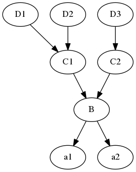
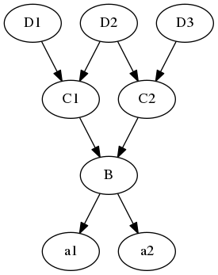

# python的编码规范

1.  用4个空格缩进
2.  每一行不超过80个字符,当一行超过80个字符时,可以用,当对一个二元操作符断行时,应该将操作符留在 上一行,
    对于函数定义以及调用,那么根据括号来对齐.
3.  模块内容的顺序：
      - 模块说明和docstring
      - import
      - \_\_all\_<sub>(optional)</sub>
      - globals and constants
      - 其他定义
4.  一行只导入一个模块(不推荐 import sys, os)
5.  模块导入顺序: 标准库, 第三方库, 自己编写的库. 三者之间用空行分割, 而且三者应该紧挨着模块字符串的后面
6.  模块级别的函数定义, 类定义用2个空行分割, 类方法用一个空行分割
7.  空格的添加:
      - 二元操作的两边各放一个空格, 但是对于有多个操作符的情况,可以只在低优先级 的操作符两边放空格
        
        ``` python
        i = i + 1
        submitted += 1
        x = x*2 - 1
        hypot2 = x*x + y*y
        c = (a+b) * (a-b)
        ```
    
      - 标点符号的后面放空格,前面不要放空格,在(, {, \[之后以及), }, \]之前不要放空格,函数调用时函数名与左括号之间
        不要放空格
        
        ``` example
        Yes: spam(ham[1], {eggs: 2})
        No:  spam( ham[ 1 ], { eggs: 2 } )
        No:  spam (ham[1], {eggs:2})
        
        Yes: if x == 4: print x, y; x, y = y, x
        No:  if x == 4 : print x , y ; x , y = y , x
        
        Yes: spam(1)
        No:  spam (1)
        
        Yes: dict['key'] = list[index]
        No:  dict ['key'] = list [index]
        ```
    
      - 不要在用于指定关键字参数 (keyword argument) 或默认参数值的 '=' 号周围使用空格。
8.  命名
      - 模块名与包名: 全部用小写字母, 模块名可以添加下划线来增加可读性, 包名不建议添加下划线,名字尽量短一点,因
        为有些文件系统对文件长度有要求
      - 类名: 使用驼峰命名法,如果是内部类,则在前面加一个下划线
      - 异常名: 异常是类, 所以使用驼峰命名法,但是必须有Error后缀
      - 函数名: 必须是小写字母, 用下划线去增加可读性
      - 类方法: 和函数名相同, 对于non-public函数, 可以在前面加一个下划线, 前面加两个下划线主要是避免与子类命名
        冲突(一般用户命名变量不推荐使用)
      - 常量名: 全部大写, 用下划线分割增加可读性

# python 文件处理

open打开文件时的选项：

  - w, w+: 如果文件已存在，那么二者都会将文件内容清除

  - r+: 如果写文件，那么会从当前位置覆盖写，而不是插入，当用该模式打开文件，读 入文件内容，然后用覆盖该文件时应使用如下代码
    
    ``` python
    with open(filename, 'r+') as  f:
        content = f.read()
        new_content = do_something()
        f.seek(0)
        f.write(new_content)
        f.truncate()                # 删除当前读写位置到文件末尾的内容
    ```

  - b: 在python2中，linux指定与不指定问题不大，但是建议对于二进制文件比如图片还
    是指定该选项比较好，避免移植到windows出现问题，在python3中，对于文本文件，
    如果不指定该选项，那么会返回unicode string， 而如果指定该选项则返回byte string,
    所以对于二进制文件,你必须指定b

遍历一个文件夹的所有文件

``` python
import os
import os.path

import os
from os.path import join, getsize
for root, dirs, files in os.walk('python/Lib/email'):
    for afile in files:
        full_name = os.path.join(root, afile)
        do_something(full_name)
```

# 作用域规则

1.  if, for, while等不会创建新的作用域, 也就是说它们不同于c中block structure.
2.  每一个模块会创建一个模块作用域
3.  每一个函数(包括嵌套定义的函数) 都创建一个函数作用域
4.  在一个作用域内第一次赋值会创建一个新的 **绑定**, 以后对该变量的赋值都是对该 绑定的 **修改**.
5.  在内层作用域可以引用外层作用域的变量, 但是你不能修改外层作用域的变量, 因为
    你在在内层作用域一旦对该变量使用赋值,那么就是创建一个新的绑定,
    所以为了改 变模块作用域中的变量你必须使用global来申明, 但是你永远也不能在内层函数中改
    变外层函数的变量(当然你可以通过subscript或者attribute來修改可变对象的值,
    只是这是引用的关系, 和作用域关系不大),这是python设计的不够好的地方.

# 杂七杂八

## 除法

  - X/Y: python2中的行为和C语言类似，3/2=1, 3/2.0=1.5;
    在python3中，这是真除法，也就是会一直保留小数位,3/2
    = 1.5
  - X/*Y: 在python2以及3中都是floor除法，也就是取整数区间的左边边界，5//2 = 2, 5/*-2 = -3

## 一些内置函数的解释

## dir

获得对象的所有属性,也就是顶层的那些names

## globals And lolcals

1.  `globals()`: 返回一个字典,字典包括当前模块(也就是调用 `globals()` 的模块) 的所有模块级属性, 同时还包括
    `__builtins__` 属性, 还包括几个特殊变量 `__file__, __package__, __doc__`.
2.  locals(): 这个只返回局部空间(比如函数的局部变量)的变量与值的字典,注意这个字典不能修改,如果强行修改会引发
    严重后果,比如解释器崩溃

## getattr,\_\_getattr\_\_,\_\_getattribute\_\_

1.  `__getattr__` 只有在属性不存在时才调用,该方法用的多
    
    ``` python
    class ClassName(object):
        def __init__(self, obj):
            self.obj = obj
    
        def __getattr__(self, name):
            if name.startswith("__") and name.endswith("__"):
                return super(ClassName, self).__getattr__(name)
            dosomething()
            return super(ClassName, self).__getattr__(name)
    ```
    
    **在该函数中不要使用不存在的属性，因为这会导致循环递归**, 该函数实现不正确很
    容易导致copy，pickle之类的模块出现循环递归。因为copy，pickle之类的模块在创
    建新对象的过程大体时这样的：
    
    1.  调用 `__new__` 创建一个新对象
    2.  调用 `__setstate_` 来设置对象状态
    
    第一步并没有调用 `__init__`, 所以很多属性(比如obj)是不存在的，一旦你在 `__getattr__` 使用了
    `__init__` 中创建的属性，并且你又没有定义 `__setstate__` 的话，那么第二步就会导致循环递归。 避免循环递归的
    方式有以下几种：
    
    1.  是过滤掉 `__xxx__` 这样的属性,就像示例中那样。这样 `__setstate__` 之类的属性就被过滤掉了
    
    2.  定义 `__setstate__`, 这样第二步就不会进去 `__getattr__`
    
    3.  在 `__getattr__` 的开头过滤掉你所使用的属性。 比如：
        
        ``` python
        def __getattr__(self, name):
            if name == "obj":
                raise AttributeError()
        ```

2.  \_\_getattribute\_\_是每一次obj.attr时都会调用,所以它可以拦截所有的属性查询, 用的很少

3.  getattr: 原型getattr(object, name\[, default\]), getattr(x,
    'foobar')等价于x.foobar优势就在于getattr可以
    使用字符串,注意如果是获得类实例的方法,那么self参数就可以忽略了,只需要传入除self之外的其它参数就好

## \_\_import\_<sub>(接字符串而不是name)</sub>

原型： \_\_import\_<sub>(name\[, globals\[, locals\[, fromlist\[,
level\]\]\]\])</sub>

  - fromlist： 指定需要从name中导入的属性名，一般而言也就是from module1 import attr1,
    attr2…中的 attr1,attr2… **这个参数一般需要指定**
  - level: 指定使用绝对导入还是相对导入，-1是默认会同时尝试二者，0是绝对导入，正数是相当于加几个. ,比如如果
    为1,那就是加一个.也就是当前目录，如果是2,那就是加两个点，在当前模块的父目录中导入，和import中的相
    对导入语法类似

<!-- end list -->

``` python
# snippet 1
from spam.ham import eggs, sausage as saus

# snippet 2
_temp = __import__('spam.ham', globals(), locals(), ['eggs', 'sausage'], -1)
eggs = _temp.eggs
saus = _temp.sausage
```

两段代码等价, \_\_import\_\_接的是字符串

# 装饰器

## 装饰器的基本形式

``` python
def deco(func):
    def _deco():
        print("before myfunc() called.")
        func()
        print("  after myfunc() called.")

    return _deco

@deco
def myfunc():
    print(" myfunc() called.")
```

上面的@deco 等价于 myfunc = deco(myfunc), 这就是装饰器的本质所在,
注意\_deco必须与myfunc有相同的参数,因为 装饰后调用myfunc实际是调用\_deco,
当然\_deco可以使用\*args, \*\*kargs这样的可变参数

## 使用类作为装饰器(推荐的做法)

``` python
class deco(object):
    def __init__(self, func):
        self.func = func

    def __call__(self, *args, **kwargs):
        print("before myfunc() called.")
        func()
        print("  after myfunc() called.")

@deco
def myfunc():
    print(" myfunc() called.")

```

myfunc = deco(myfunc) 所以myfunc就是一个deco类的实例，然后`myfunc(*args, **kwargs)`,实际就是调用类实例 的`__call__`方法

## 使用类作为装饰器装饰类方法

下面的代码也可以装饰非类方法,也就是装饰普通函数,也就意味着下面的代码可以替代2,因为如果装饰的是普通函数,
那么会直接调用该函数,所以不会触发descriptor的\_\_get\_\_方法

``` python
class deco(object):
    def __init__(self, func):
        self.func = func

    def __call__(self, *args, **kwargs):
        print("before myfunc() called.")
        self.func(*args, **kwargs)
        print("  after myfunc() called.")

    def __get__(self, obj, objtype):
        import functools
        return functools.partial(self.__call__, obj)

class Test(object):
    @deco
    def myfunc(self):
        print(" myfunc() called.")

```

这与2最大的区别就是使用了descriptor，也就是\_\_get\_\_, 之所以这么写是因为，如果像2一样，那么就没有给myfunc
传递self参数，所以python会报缺少参数的错误，下面解释一下代码运行的流程，deco装饰后，myfunc变成一个deco的
类实例，注意deco定义了\_\_get\_\_,
所以myfunc就变成了一个descriptor对象，当你使用test\_obj.myfunc(\*args,
\*\*kwargs)调用的时候，也就触发了test\_obj.myfunc的属性搜索，那么根据descriptor的规则，就变成了
myfunc.\_\_get\_<sub>(test\_obj)</sub>,该函数返回已将test\_obj绑定到myfunc.<span class="underline"><span class="underline">call</span>\_的第一个参数的partial
函数，接着这个 函数在接受\*args,
\*\*kwargs参数，总之就是通过descriptor将test\_obj传递给了\_\_call\_</span>,从而消除了缺少self的问题

## 给装饰器添加参数

``` python
 def deco(arg):
     def _deco(func):
         def __deco():
             print("before %s called [%s]." % (func.__name__, arg))
             func()
             print("  after %s called [%s]." % (func.__name__, arg))
         return __deco
     return _deco
@deco("mymodule")
 def myfunc():
     print(" myfunc() called.")
@deco("module2")
 def myfunc2():
     print(" myfunc2() called.")
myfunc()
 myfunc2()
```

需要给装饰器加参数.那么就给多添加一个嵌套函数, 这个参数可以是类以及其它对象

## functools模块

  - wraps: 这个装饰器可以确保函数在装饰后属性的一致,比如上面的例子 myfunc=deco(myfunc), 那么此时
    myfunc的\_\_name\_\_,
    \_\_doc\_\_等属性都不在是原myfunc的值了,而是\_deco的值,每一次装饰之后这些函数对象的元信
    息都丢失的话,那么这显然是一个大问题,而wraps可以用来应付这个问题
    
    ``` python
     import functools
    def deco(func):
         @functools.wraps(func)
         def _deco():
             print("before myfunc() called.")
             func()
             print("  after myfunc() called.")
        return _deco
    @deco
     def myfunc():
         print(" myfunc() called.")
    ```
    
    @functools.wraps(func)这行代码可以保证,通过装饰器调用后,函数\_\_name\_\_,
    \_\_doc\_\_仍然和原来的函数一致

  - partial: 有时候你知道一个函数的一部分参数,这个时候你可以先绑定这些参数,绑
    定这些参数之后会返回一个partial对象,你可以当这个对象就是一个以绑定了一些参
    数的函数,就是函数式语言中的curry,partial大体上等于以下代码
    
    ``` python
    def partial(func, *args, **keywords):
        def newfunc(*fargs, **fkeywords):
            newkeywords = keywords.copy()
            newkeywords.update(fkeywords)
            return func(*(args + fargs), **newkeywords)
        newfunc.func = func
        newfunc.args = args
        newfunc.keywords = keywords
        return newfunc
    
    ```

# 迭代器

## 迭代器的基本知识

迭代器对象是序列对象的一般化,每一个迭代器对象都有一个next方法,该方法每调用一次都会返回下一个元素,当没有元素
可返回时要触发StopIteration异常,这就是迭代对象的实质了

## 生成器generator

从大多数方面看生成器函数和普通函数一致,它们二者最大的不同时,普通函数是直接通过return返回一个值,而生成器函
数是通过yield返回一个迭代器对象,所以每一个生成器函数调用后都是返回一个迭代器对象,这是本质的区别

## for循环的迭代过程

for item in obj语句的执行过程其实是这样

1.  先运行iter(obj) 获得迭代器对象 iter\_obj
2.  重复的调用iter\_obj.next() 直到出现StopIteration异常
3.  如果上述两步已成功,那么for循环就结束了,如果上述两步没成功,这意味着obj不支持迭代协议,那么for就会尝试使用
    下标来遍历那么会使用下标来遍历,也就是从0开始每一轮循环都对下标加一,而且每一轮循环都使用obj\[i\]
    来访问元 素,直到触发异常

# with

基本模型：

``` example
with exp as name:
    body
```

先对exp求值得到val，然后调用val的\_\_enter\_\_ 方法，最后将val绑定到name，接着运
行body，在要退出body时运行val的\_\_exit\_\_方法。File对象已经自带了这两个特殊方法，
所以打开文件时，with用的很多。

# 模块

模块的\_X与\_\_all\_\_: 当调用from XX import \* 时, 如果指定了\_\_all\_\_, 那么就只导
入\_\_all\_\_中的名字,如果没指定\_\_all\_\_,那么导入所有除了以下划线开头的全部模块级 名字, 也就是说不会导入
\_X 这样的名字

## absolute import

只导入 `sys.path` 指定的路径下的模块，一般来说sys.path的第一项就是 **作为入口 被执行的脚本的所在的目录**,
比如你在命令行执行 `python aa.py` 那么第一项就是 `aa.py` 所在的目录. 绝对导入的语法：

``` python
import foo
from xxx import aaa # xxx 不能以 . 开头
```

上面的这种语法在Py2,py3中是不同的：

  - py3： 是绝对导入，也就是说只搜索sys.path
  - py2: 行为比较混淆，它会同时搜索当前文件(包含import语句的文件，不是入口执行
    文件)所在目录的模块，同时也会搜索sys.path,这很容易造成包内部的模块覆盖掉
    sys.path的模块

**为了兼容性，建议使用 from
<span class="underline"><span class="underline">future</span></span>
import absolute\_import** 来统一该语法的 行为。

## relative import

相对导入必须使用from xxx import yyy 的形式, 而且xxx必须以点号开头, import xxx 的形式都是绝对导入,
相对导入需要以下的语法:对于如下的一个目录结构

``` example
package/
 __init__.py
 subpackage1/
     __init__.py
     moduleX.py
     moduleY.py
 subpackage2/
     __init__.py
     moduleZ.py
 moduleA.py

```

假设在moduleX.py or subpackage1/\_\_init\_\_.py中，那么下列的相对导入是合法的

``` python
from .moduleY import spam
from .moduleY import spam as ham
from . import moduleY
from ..subpackage1 import moduleY
from ..subpackage2.moduleZ import eggs
from ..moduleA import foo
from ...package import bar
from ...sys import path
```

一个点代表当前文件所在的目录，两个点代表当前文件所在目录的父目录，以此类推，
注意相对导入使用\_\_name\_\_属性实现的，所以对于执行模块必须小心，因为他的\_\_name\_\_属
性是\_\_main\_\_, 所以这些模块中不能使用相对导入

# OOP

## 基本OOP代码示例

类,类的实例和模块都只是一个命名空间,命名空间的属性都可以修改,所以非常灵活,对于基于类的对象而言,可以使用dir内 置函数来查看命名空间,
**类与类的实例都是对象,二者都是使用字典对象实现的命名空间,二者的\_\_dict\_\_属性基本就是命名空间 字典**, 看如下代码:

``` python
class Test(object):
    """
    a Test Class
    """
    val1 = 1
    val2 = 2
    def __init__(self, arg1, arg2):
        """
        """
        self.arg1 = arg1
        self.arg2 = arg2

    def display(self):
        """
        """
        print self.arg1, self.arg2

obj1 = Test(1, 2)
print dir(Test)
print
print dir(obj1)
```

``` example
['__class__', '__delattr__', '__dict__', '__doc__', '__format__', '__getattribute__', '__hash__', '__init__', '__module__', '__new__', '__reduce__', '__reduce_ex__', '__repr__', '__setattr__', '__sizeof__', '__str__', '__subclasshook__', '__weakref__', 'display', 'val1', 'val2']
```

:

``` example
['__class__', '__delattr__', '__dict__', '__doc__', '__format__', '__getattribute__', '__hash__', '__init__', '__module__', '__new__', '__reduce__', '__reduce_ex__', '__repr__', '__setattr__', '__sizeof__', '__str__', '__subclasshook__', '__weakref__', 'arg1', 'arg2', 'display', 'val1', 'val2']
```

val1, val2,
<span class="underline"><span class="underline">init</span></span>,
display都是类Test本身的属性, 而arg1, arg2就是类实例(obj1)的属性,实际上self产生的就是 类实例对象的属性,
当然类的实例也会继承 类的属性

## 属性搜索树

当调用obj.attr时,python有一个属性的搜索过程,比如下面的代码

``` python
class D1(object):
    pass

class D2(object):
    pass

class D3(object):
    pass

class C1(D1, D2):
    pass

class C2(D3):
    pass

class B(C1, C2):
    pass

a1 = B()
a2 = B()
```

上面的代码会构成一颗属性搜索树:



因为类本身也是对象,所以类本身也有属性,类的属性就是类的方法,以及类的变量, 比如当调用a1.x时,那么搜索的过程就 是这样的: a1, B,
C1, D1, D2, C2, D3注意这是深度优先搜索,python的经典类与新式类都是这种搜索模式，但是新式类 有一个diamond
pattern，也就是钻石模式，这种模式下有一个以上的超类会通往相同的更高层次的超类，这时候会使用
广度优先搜索(只是有相同超类的那一部分)，举个例子：



如上图所示，如果C2有个w属性，D2也有个w属性，那么当使用a1.w进行属性搜索时，如果使用深度优先搜索，那么会得到 D2.w，
但是C2是D2的子类，并且重载了w属性，这种情况下应该用子类的属性也就是C2的w属性，钻石继承就是为这种情
况准备的，在这种情况下，在C1,D2, C2会使用广度优先算法搜索，这样就可以先得到C2.w
.这个特例需要注意

## 类的设计

### is a

如何现实中两个事物是is a的关系，那么就应该用继承，比如teacher is a person，那么Teacher就应该继承Person

### has a

比如一个商店有商品，有营业员，有顾客，那么商店与商品，营业员，顾客就是has a的关系，这时候应该使用组合，也
就是说商店是一个容器，在该容器对象的构造函数中创建营业员对象，创建商品对象，创建顾客对象，具体到python就
是在\_\_init\_\_中创建这些对象

## 常见的运算符重载

1.  <span class="underline"><span class="underline">getattr</span></span>
    <span class="underline"><span class="underline">setattr</span>\_\_使用obj.attr时如果该属性obj中没有attr属性，这时会调用\_\_getattr\_</span>,
    \_\_setattr\_\_\_会 拦截所有的属性赋值，也就是obj.attr =
    val这样的语句都等价于obj.\_\_setattr\_\_<sub>('attr',
    val)</sub>，这是 和\_\_getattr\_\_不同的地方，要特别注意
2.  <span class="underline"><span class="underline">getitem</span></span>
    <span class="underline"><span class="underline">setitem</span>\_</span>
    当出现x\[i\], x\[i\] = val, 会分别调用上述方法， 当使用for 迭代时会先尝试\_\_iter\_\_,
    如果行不通，那么就使用索 引，也就是用不断递增的索引调用\_\_getitem\_\_,
    直到出现IndexError
3.  <span class="underline"><span class="underline">iter</span></span>
    必须返回一个迭代器对象，一个拥有next方法的对象就是迭代器对象，如果使用for 在该对象上迭代，它会先使用
    iter内置函数来调用\_\_iter\_\_
    方法获得迭代器对象，然后重复的调用该迭代器对象的next方法，直到该next方法产生
    StopIteration异常。
4.  <span class="underline"><span class="underline">call</span></span>
    将类实例作为函数调用时就是使用的该方法，比如obj是一个类实例，那么obj('a', 'b')等价于
    obj.\_\_call\_<sub>('a','b')</sub>,这是一个很常用的方法

## Descriptor

任何对象只要定义了\_\_get\_\_,
<span class="underline"><span class="underline">set</span></span>,
\_\_del\_\_三者之一，那么就是descriptor，这
是一份不错的[tutorial](http://docs.python.org/2/howto/descriptor.html)，
示例代码:

``` python
class RevealAccess(object):
    """A data descriptor that sets and returns values
       normally and prints a message logging their access.
    """

    def __init__(self, initval=None, name='var'):
        self.val = initval
        self.name = name

    def __get__(self, obj, objtype):
        print 'Retrieving', self.name
        return self.val

    def __set__(self, obj, val):
        print 'Updating' , self.name
        self.val = val

class MyClass(object):
    x = RevealAccess(10, 'var "x"')
    y = 5
```

输出

``` example
>>> m = MyClass()
>>> m.x
Retrieving var "x"
10
>>> m.x = 20
Updating var "x"
>>> m.x
Retrieving var "x"
20
>>> m.y
5
```

上例中 m.x
是一个descriptor，因为它是RevealAccess的类实例，而该类定义了\_\_get\_\_与\_\_set\_\_,所以
m.x 实际上等价 于 x.\_\_get\_<sub>(m)</sub>

# metaclass

在python中类也是对象，生成instance的叫class，生成class的就叫metaclass。type就是
python中内建的一个metaclass

# python异常

只说明基于类的异常, 老版的python中基于字符串的异常不考虑

## try … except语句

``` example
try:
    main-block
except class1:
    handler1
except class2, instance:
    handler2
except (class3, class4):
    handler3
except (class5, class6), instance:
    handler4
except:
    handler5
else:
    else-block finally: finally-block
```

python2.5以后版本才可以else,finally混在一起,执行try 中语句块时如果没有出现异常,那么就执行else 语句块,如果出
现了异常,那么就从上到下的匹配ecxept子句,最后执行第一个匹配的except 语句块, finally是无论是否发生异常,以及无
论是否捕捉了异常都会执行的

## raise

raise语句的几种形式

1.  raise : 重新触发上一次产生的异常
2.  raise instance : 触发为name的异常
3.  raise class, instance : 和2类似,只是data是额外数据

**上述的instance应该是一个异常类的实例**,目前第二种最常用,为了兼容raise instance还有以下的几种衍生形式

  - raise class : 等同于 raise class()
  - raise class, arg :等同于raise class(arg)
  - raise class, (arg1, arg2,…) : 等同于raise class(arg1, arg2,…)

## 异常

异常都是类, exceptions must be old-style classes or derived from
BaseException.也就是说,要么是老式类,要么
是BaseException的子类,实践中用户自定义的类最好继承于Exception,并且必须以Error结尾,
**注意except语句是基于超 类匹配的**

# python中文处理

中文处理一直是一个比较棘手的问题,各种乱码一直让程序员苦不堪言,这里主要介绍 python中文处理的一般原则,
先介绍几个基本概念(强烈建议看看这篇[文章](http://nedbatchelder.com/text/unipain.html)):

1.  unicode: 简单点说你可以将unicode看成一种映射,地球上的每一个符号都在unicode 中有一个数(准确的说叫code
    point)与之对应
2.  utf8, utf16: 刚刚说了地球上的每一个符号在unicode中有一个数与之对应,那么这 个数如何存储在计算机上呢?utf8,
    utf16, utf32就是存储策略
3.  big5, gb2312等: 这些都是各个地区自行发明的双字节码,也就是两个字节代表一个 符号

python字符处理的基本概念:

1.  byte string: 字节流, utf8,utf16, gb2312等编码后得到的string都是字节流,通过
    decode方法可以得到unicode string
2.  unicode string: unicode字符串的每一个字符都是一个code point, 它可以通过
    encode方法转换为各种byte string

因此python中文处理的实质就是在byte string与unicode string之间来回转换, 因为
python解释器在解释python源文件时,也是需要编码信息的,所以在文件的前两行必须指
定编码信息(coding:utf8), **指定的编码必须与python源文件保存时的编码一致**

python2与python3的区别:

1.  python2中字面字符串是byte string, 而3中是unicode string
    
    ``` python
    ss = '你好'                     # python2为byte string, python3为unicode string
    ss = u'你好'                    # python2得到unicode string
    ss = b'你好'                    # python3得到byte string
    ```

2.  对二者名称不同
    
    | category       | python2 | python3 |
    | -------------- | ------- | ------- |
    | byte string    | str     | bytes   |
    | unicode string | unicode | str     |
    

3.  读取文件时,python2得到byte string, 而python3调用open时如果指定了b则得到 byte string,
    如果没有指定b, 那么就会使用local.getpreferredencoding()返回的
    编码方式来decode,然后得到unicode string.
    python3中调用open时有一个可选参数 来指定解码方式..

4.  混合时的处理方式不同,如一个byte string与一个unicode string相加,那么python2
    会使用sys.getdefaultencoding()返回的编码方式来decode那个byte string, 然后
    与unicode string相加得到一个unicode string,但是python3会返回异常因为
    python3不允许二者混合.

# 一些很诡异的问题

## 传引用

``` python
gg = None
def test(aa={}):
    print aa
    global gg
    gg = aa

test()
gg["hello"] = "world"
test()
```

第一次调用test, aa是{}, 第二次调用就是{"hello": "world"}了, 所以默认参数可是 可变对象时,要特别注意,
一定要确定是否需要使用copy.

# 一些标准库的使用说明

## python 正则表达式

python的正则表达式是通过re这个标准库支持的,这是一篇写的不错的[文章](https://www.evernote.com/shard/s89/sh/8d66ae55-5f2e-4a68-b11d-c8ae8ad3de56/00bfb7913d34061da0083d8286ff1592),
我可耻的用evernote保存下来 了,上面有原文章的连接.

## logging

和log4j类似,先说几个基本概念

### 基本概念

1.  Logger: 用户程序主要调用的就是该类的实例的方法
2.  Handler:　指定日志应该保存到何处，比如console,file等等.
3.  Filters: 指定过滤条件,他可以确定哪些日志输出
4.  Formatters: 确定日志格式的

### logger层次关系

获得logger一般使用 `logging.getLogger` 这个api, 它会接受一个name参数, name 如果不指定那么获得root
logger, 假设如下代码:

``` python
import logging

root = logging.getLogger()
logger1 = logging.getLogger("aa")
logger2 = logging.getLogger("aa.bb")
```

**root是所有logger的父logger**, 所以root是logger1的父logger, logger1又是
logger2的父logger, 实际上就是将logger像python的模块那样建立层次结构, 子
logger的消息会传递给父logger, 所以你运行这行代码
`logger2.info("hello..")`, 那么消息也会传递到logger1, root,
如果这两个logger的设置允许输出消息,那么该
消息可能logger2,logger1,root分别输出

### 日志输出的过程

假设你运行 `logger.info("hello")`, 那么这条消息如何输出呢?

1.  如果logger的level比info高,那么不输出, 如果有注册的filter返回false那么不 输出.
2.  将消息发送给注册在logger上的所有handler,有handler来局定消息如何处理
3.  对单个handler而言,如果hander的level比info高,那么不输出,有注册的filter返
    回false那么不输出,否则就输出

**不管logger是否输出该消息,该消息都会发往父logger.**

### 常用api

1.  logging.basicConfig: 用来设置root logger的handler, 如果发现handler已设置,那
    么什么也不做.
2.  logging.getLogger: 用来创建logger, 如果参数为空,那么返回root logger.

logger对象的方法:

1.  `logger.debug(msg, *args, **kwargs)`: msg是字符串,其中可以包含%s, %d这样 的格式化信息,
    args包含提供给msg的字符格式化参数, kwags中有两个key会检查:
      - exc\_info: 如果为True, 那么logger会调用 `sys.exc_info` 来获得一个记录异 常信息的三元组,
        接着就会将三元组记录的异常调用栈记录进日志, 注意 **只在 except语句块中有效**, 因为你必须在处理异常时,
        sys.exc\_info才能获得调用栈. 当然你可以明确的指定一个三元组, 而不是简单的指定True, 这样logger就会使
        用你指定的三元组的异常信息,而不是调用 `sys.exc_info` 来获得, 因此也就 不存在只在except块有效的限制.
      - extra: 指定参数来初始化log record, 可以用它来修改本条日志的一些格式
2.  logger.info
3.  logger.warning
4.  logger.error
5.  logger.critical

## 多线程

### Thread

### threading

threading是一个更高层的模块，它使用更加方便，所以一般情况都是使用该模块

1.  threading.Thread: 要创建一个线程，那么需要先创建threading.Thread的子类，并且重写它的run方法，每一个
    Thread对象都要调用start方法，该方法启动线程，该线程会运行该对象的run方法 daemon：
    如果已经没有活动的non-daemon(daemon=False)线程的话,
    整个进程都会退出,所以经常将子线程的daemon 设为True,并且子线程做成一个while
    True的死循环,这样如果主线程退出,那么整个进程都会退出,那些死循环的子线 程自然也会退出

2.  Queue: 同步队列
    
    ``` python
    from Queue import Queue
    q = Queue()
    # thread1
    item = q.get()
    do_something(item)
    q.task_done()
    
    # main thread
    q.join()
    ```
    
    实际上task\_done就是将内部的计数器减一, 而put会将内部的计数器加1,然后join会测试如果内部的计数器为0就返
    回,不为0就阻塞

## collections

### Counter

字典的子类，可以用于统计可迭代对象中重复元素出现的次数,这是[文档](http://docs.python.org/2/library/collections.html#counter-objects)

``` python
from collections import Counter
cn_str = Counter('hello world')
print cn_str

cn_list = Counter(['red', 'blue', 'red', 'green', 'blue', 'blue'])
print cn_list

cn_dict = Counter(cats=4, dogs=8)
print cn_dict
```

``` example
Counter({'l': 3, 'o': 2, ' ': 1, 'e': 1, 'd': 1, 'h': 1, 'r': 1, 'w': 1})
Counter({'blue': 3, 'red': 2, 'green': 1})
Counter({'dogs': 8, 'cats': 4})
```

Counter除了有dict的方法外，还有几个特有的方法

1.  elements(): 返回可迭代对象，比如调用cn\_list.elements() 就会返回\['red', 'blue',
    'red', 'green', 'blue', 'blue'\]
2.  most\_common(\[n\]) : 根据字典色value从大到小排出n个item组成一个list

### deque 双端队列

可以从左边或者右边添加或者删除元素,这是[文档](http://docs.python.org/2/library/collections.html#deque-objects)
,主要有append,appendleft(单个元素),extend,extendleft(可迭代对 象),pop, popleft等等

### defaultdict

提供了一个default\_factory属性,通过初始化defaultdict实例时对该属性赋值,那么以后如果出现key不存在的情况,不
会出现KeyError,而是调用这个默认工厂函数,然后返回该工厂函数的返回值,这是[文档](http://docs.python.org/2/library/collections.html#defaultdict-objects)
,这是几段代码示例:

``` example
# 以list 作为default_factory
>>> s = [('yellow', 1), ('blue', 2), ('yellow', 3), ('blue', 4), ('red', 1)]
>>> d = defaultdict(list)
>>> for k, v in s:
...     d[k].append(v)
...
>>> d.items()
[('blue', [2, 4]), ('red', [1]), ('yellow', [1, 3])]

# 以整数作为default_factory
>>> s = 'mississippi'
>>> d = defaultdict(int)
>>> for k in s:
...     d[k] += 1
...
>>> d.items()
[('i', 4), ('p', 2), ('s', 4), ('m', 1)]
```

### namedtuple

一个tuple的子类,可以给tuple的每一项添加一个名字,以后就可以通过 X.y这样的方式来访问了,看代码:

``` python
from collections import namedtuple

Point = namedtuple('Point', ['x', 'y'], verbose=False)
p = Point(11, y=22)
print p

s = p[0] + p[1]                 # like normal tuple
print s

s = p.x + p.y
print s
```

``` example
Point(x=11, y=22)
33
33
```

上述代码代表一个点,点有x,y两个值,要访问点的x,可以通过p.x 或者 `p[0]` (也就是和普通的tuple一样)

### OrderedDict

OrderedDict是dict的子类,它会记住key插入的顺序,默认的dict是会排序的, 比如下面的代码

``` python
from collections import OrderedDict
l = [('b', 3), ('f', 2), ('a', 1)]
d = dict(l)
print d

od = OrderedDict(l)
print od
```

``` example
{'a': 1, 'b': 3, 'f': 2}
OrderedDict([('b', 3), ('f', 2), ('a', 1)])
```

popitem(last=True): last为True,那么就是LIFO, 比如上例就是先弹出(a, 1) 然后(f, 2),
如果last为False,那么就 是FIFO

## pickle

  - dump(self, obj, file) 将对象序列化到文件
  - dumps(self, obj) 会返回序列化的字符串
  - load(file) 从文件加载对象
  - loads(str) 从字符串加载对象

<!-- end list -->

``` python
import pickle
d = {'tag':'django'}
with open('aa.pickle', 'wb') as fp:
    pickle.dump(d, fp)

with open('aa.pickle', 'rb') as fp:
    d = pickle.load(fp)
```

## json

和pickle类似,也是dump,dumps,load,loads这几个接口(以s结尾的就是字符串,否则就
是文件),json模块默认只能encode与decode python的内置类型，比如数字，字符串，
list，tuple，dict等，如果你要endcode自定义的类，那么你需要扩展，代码示例如下：

<script src="https://gist.github.com/yuyang0/6945963.js"></script>

调用的时候直接使用如下代码：

``` python
d = {
    'status': 0,
    'data': list(comments),
}

json.dumps(d, cls=CustomTypeEncoder,
           user=request.user)
```

cls参数指定用来encode的class，后面的user参数用来向自定义的encoder中添加额外
的参数，可以在自定义的encoder的init函数中获取，可以参见上面的encoder的代码

## HTMLParser

文档中的示例代码:

``` python
from HTMLParser import HTMLParser

# create a subclass and override the handler methods
class MyHTMLParser(HTMLParser):
    def handle_starttag(self, tag, attrs):
        print "Encountered a start tag:", tag
    def handle_endtag(self, tag):
        print "Encountered an end tag :", tag
    def handle_data(self, data):
        print "Encountered some data  :", data

# instantiate the parser and fed it some HTML
parser = MyHTMLParser()
parser.feed('<html><head><title>Test</title></head>'
            '<body><h1>Parse me!</h1></body></html>')
```

从上面的代码可以看出:该库的使用方法就是在类中处理starttag, endtag, data(标签中间的文本)
然后调用feed方法就好,实际是一个流式html解析器

# 一些第三方库的使用方法

## requests

python的标准库中的urllib,urllib2的接口并不好用,requests的接口更简洁一致,这是官方[文档](http://docs.python-requests.org/en/latest/)

1.  get requests.get(url, \*\*kwargs)
    
    ``` python
    payload = {'key1': 'value1', 'key2': 'value2'}
    r = requests.get("http://httpbin.org/get", params=payload)
    ```

2.  post requests.post(url, data=None, \*\*kwargs)
    
      - data: 是要post的数据
      - kwargs: 可以使用headers = {….}指定http request header
    
    <!-- end list -->
    
    ``` python
    import json
    url = 'https://api.github.com/some/endpoint'
    payload = {'some': 'data'}
    headers = {'content-type': 'application/json'}
    
    r = requests.post(url, data=json.dumps(payload), headers=headers)
    
    ```

3.  put requests.put(url, \*\*kwargs)

4.  response object
    
    ``` python
    import requests
    r = requests.get('http://www.baidu.com')
    print r.text
    print r.url
    print r.encoding
    print r.status_code                    # response status code(eg:200)
    print r.headers                        # a dict
    print r.headers['Content-Type']        # response headers
    print r.cookies['example_cookie_name'] # cookies
    print r.json()                         #  built-in json function
    
    print r.request.headers         # http request headers
    ```

## pip

从github安装包 pip install git+<git://github.com/yourname/package.git> 或者pip
install git+<https://github.com/yourname/package.git>

## pyquery

一个使用jquery语法的html解析器,非常方便,比BeautifulSoup好用,这是它的[文档](http://pythonhosted.org/pyquery/index.html)

``` python
form pyquery import PyQuery
html = '<html><title>hello world</title></html>'
d = PyQuery(html, parser = 'html')
d('title').text()
```

在调用PyQuery时尽量指定parser, 因为默认判断有时会出错,比如用xml的parser去解析html会得到不正确的结果.

``` python
d = PyQuery(html, parser = 'html')
# selector
d('body')
d('div#header')
d('div.class ul')
d('meta[name=keywords]') #attribute

links = d('div.links a')
# 该处应使用下标,而不是for link in links
for i in range(0, len(links)):
    print links.eq(i).attr('href')
```

## watchdog

看门狗,用来监控文件系统改变,这是[文档](http://pythonhosted.org/watchdog/), 基本使用:

``` python
import time
from watchdog.observers import Observer
from watchdog.events import LoggingEventHandler

if __name__ == "__main__":
    event_handler = LoggingEventHandler()
    observer = Observer()
    observer.schedule(event_handler, path='.', recursive=True)
    observer.start()
    try:
        while True:
            time.sleep(1)
    except KeyboardInterrupt:
        observer.stop()
    observer.join()
```

关键的部分有两个:

1.  recursive=True,默认是False,如果不指定那么那么就不会监控子目录
2.  event\_handler:这个是文件系统事件的处理对象,可以自己继承watchdog.events.FileSystemEventHandler,
    然后重载[on\_create](http://pythonhosted.org/watchdog/api.html#watchdog.events.FileSystemEventHandler.on_created)d,
    [on\_deleted](http://pythonhosted.org/watchdog/api.html#watchdog.events.FileSystemEventHandler.on_deleted),
    [on\_modified](http://pythonhosted.org/watchdog/api.html#watchdog.events.FileSystemEventHandler.on_modified),
    [on\_moved](http://pythonhosted.org/watchdog/api.html#watchdog.events.FileSystemEventHandler.on_moved),

## rauth

一个Oauth库,这是[文档](https://rauth.readthedocs.org/en/latest/), 这是一份示例
[代码](https://gist.github.com/yuyang0/5949932), 基本上照着流程走就OK了

# 测试

流行的就是pytest了，tox可以测试代码在不同环境下(py2.7, py3.5, flake8 etc..)是否 能通过,
它可以自动测试这些环境，很方便, 这些工具的配置比较乱

  - tox: 配置文件: `tox.ini`
  - pytest: 配置文件: `pytest.ini`, `tox.ini`, `setup.cfg`
  - pytest-cov: 配置文件 `setup.cfg`
  - pep8: 配置文件　=tox.ini=, `setup.cfg`
  - flake8: 配置文件　=tox.ini=, `setup.cfg`

**我的建议是tox的配置放在tox.ini中，其它的都放在setup.cfg中**

## example

tox.ini

``` example
[tox]
envlist = py27, py35, pypy, flake8

[testenv]
commands = {envpython} setup.py test
deps = -rrequirements.txt

[testenv:flake8]
basepython=python
deps=flake8
commands=flake8 setup.py tests

[testenv:pypy]
basepython=pypy
```

setup.cfg

``` example
[metadata]
description-file = readme.md

[aliases]
test=pytest

# pytest-cov configuration
[coverage:run]
omit =
    gmesos/api.py
    gmesos/deployment.py

# pytest configuration (pytest>3.0)
[tool:pytest]
testpaths = tests
addopts = --cov=gmesos --cov-report term-missing

# pep8 configuration
[pep8]
exclude = gmesos/interface.py
max-line-length = 160

# flake8 configuration
[flake8]
exclude = gmesos/interface.py,venv/
max-line-length = 160
ignore= F401
```

# 常用工具的使用方法

## virtualenv

这是一份不错的[tutorial](http://docs.python-guide.org/en/latest/dev/virtualenvs.html)

1.  virtualenv venv
2.  source venv/bin/activate
3.  deactivate

virtualenvwrapper可以对virtualenv进行一定的增强

1.  install
    
    ``` example
    
    sudo pip install virtualenvwrapper
    export WORKON_HOME=~/envs
    source /usr/local/bin/virtualenvwrapper.sh
    
    ```

2.  mkvirtualenv my\_env 在WORKON\_HOME中创建一个名为my\_env虚拟环境

3.  workon my\_env 切换到my\_env环境

4.  deactivate

5.  lssitepackages

6.  lsvirtualenv

7.  rmvirtualenv my\_env

和zsh的整合： 安装virtualenvwrapper插件，然后在每一个仓库中放一个.venv文件，文件的内容 是你创建的env的名字

## ipython

ipython是一个增强的python interpreter,有许多有趣的功能

1.  magic function 以 % 或者 %% 开头的都是magic function,其中
      - 以%开头会将本行余下的部分作为一个参数传递给该命令,如果%automagic为on(默认), 那么可以省略前面的 %, 可以
        使用 %lsmagic 来列出有多少这种命令.
      - 以%%开头的命令不仅会将本行余下的部分作为参数,本行下面独立的行也会作为参数
2.  TAB补全, 可以补全内置的函数,模块以及变量文件名等等
3.  %run命令: 该命令可以用来运行脚本(实际是把所有的属性导入当前的namespace,和import功能类似),测试脚本时用该
    命令,而不是import,因为该命令可以让改动立即生效,有以下几个选项:
      - t: 可以用来获得脚本的运行时间
      - p: 性能分析,会列出程序中每个函数调用的时间, %prun命令与该选项功能相似,但是它是对一条python命令或者一个函数调
        用进行性能测试
      - d: 调试,激活pdb,并在开始处暂停,和gdb类似
4.  剖析对象,给定一个对象,观察这个对象的文档,函数定义以及源代码,有以下命令
      - %pdoc: print doc string
      - %pdef: print definition of function
      - %psource: print source code
      - %pfile: get file of this object
5.  调试: %pdb命令会打开或关闭在任何未捕捉的异常点调用pdb调试器的功能, 如果该功能打开了,那么遇到任何未捕捉的
    异常,会自动调用调试器,这样就可以打印异常点的变量值,执行代码了
6.  运行shell命令: \!开头,比如 \!ping www.baidu.com ,可以将shell命令的输出赋给python变量, 比如
    output = \!ping www..baidu.com, 那么output就会是ping的输出
