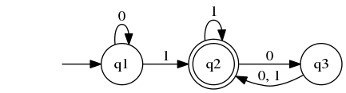
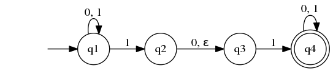
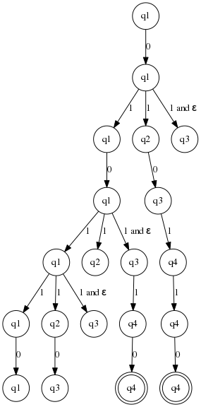
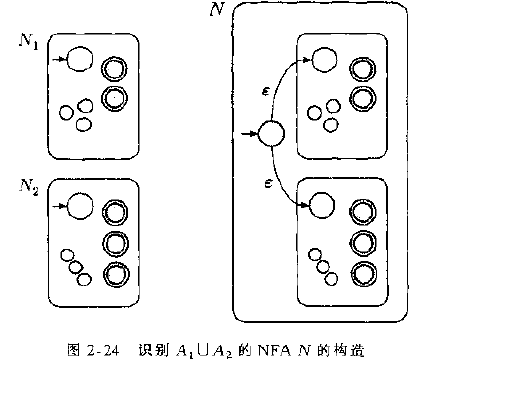
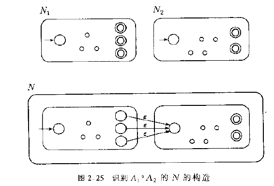
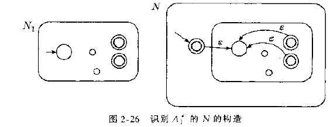

# 自动机理论

## 正则语言

### Concepts

  - DFA: 确定型有穷自动机
  - NFA: 非确定有穷自动机
  - 正则语言：能被一个有穷自动机接受的语言就是正则语言
  - 语言: 如果 `A` 是机器 `M` 所接受的所有字符串组成的集合,那么我们就说 `A` 是 机器 `M` 的语言.也可以写作
    L(M)=A 或者 M 识别 A.

### DFA

1.  Definition
    
    有穷自动机是一个五元组 $(Q, \Sigma, \delta, q_0, F)$:
    
    1.  Q 是一个有穷集合,叫 **状态集**.
    2.  $\Sigma$ 是一个有穷集合,叫 **字母表**.
    3.  $\delta: Q \times \Sigma \rightarrow Q$ 是 **转移函数**.
    4.  $q_0 \in Q$ 是 **起始状态**.
    5.  $F \subseteq Q$ 是 **接受状态**.

2.  example
    
    下面是一个叫 M<sub>1</sub> 的有穷自动机
    
    
    
    形式定义如下:
    
    1.  Q 是 {q<sub>1</sub>, q<sub>2</sub>, q<sub>3</sub>}
    
    2.  $\Sigma$ 是 {0, 1}
    
    3.  转移函数 $\delta$ 由下表给出:
        
        |               |       0       |       1       |
        | :-----------: | :-----------: | :-----------: |
        | q<sub>1</sub> | q<sub>1</sub> | q<sub>2</sub> |
        | q<sub>2</sub> | q<sub>3</sub> | q<sub>2</sub> |
        | q<sub>3</sub> | q<sub>2</sub> | q<sub>2</sub> |
        

        transformation rules
    
    4.  q<sub>1</sub> 是起始状态
    
    5.  F = |q<sub>2</sub>|
    
    下面是一个M1的程序:
    
    ``` scheme
    (define (m1 ss)
      (define tbl                     ;transformation rules
        '(((q1 . #\0) . q1) ((q1 . #\1) . q2)
          ((q2 . #\0) . q3) ((q2 . #\1) . q2)
          ((q3 . #\0) . q2) ((q3 . #\1) . q2)))
      (define accepted-states
        '(q2))
    
      (define m1-inner
        (let ([state 'q1])
          (lambda (input)
            (cond [(assoc `(,state . ,input) tbl) =>
                   (lambda (entry)
                     (set! state (cdr entry))
                     (cdr entry))]
                  [else (error 'Error "unkown state input pair ~a"
                               `(,state ,input))]))))
    
      (let* ([char-lst (string->list ss)]
             [ret (last (map m1-inner char-lst))])
        (if (memv ret accepted-states)
            'accept
            'reject)))
    ```
    
    设M = $(Q, \Sigma, \delta, q_0, F)$ 是一台有穷自动机, $\omega=\omega_1
      \omega_2 ... \omega_n$ 是字母表 $\Sigma$ 上的字符串,如果存在 Q 中的状态序列:
    r<sub>0</sub>, r<sub>1</sub>, …, r<sub>n</sub> 满足下述条件:
    
    1.  r<sub>0</sub> = q<sub>0</sub>
    2.  $\delta(r_i, \omega_{i+1})=r_{i+1}, i=0,1,2,...,n-1$
    3.  $r_n \in F$
    
    则 M 接受 $\omega$.

3.  正则运算
    
    设 A 与 B 是两个语言, 定义正则运算 **并** **连接** **星号**:
    
      - union(并) : $A \cup B = \{x| x \in A  \ or \  x \in B \}$
      - concatenation(连接):
        $A \centerdot B = \{xy| x \in A \ and \ y \in B \}$
      - star 星号:
        $A^* = \{x_1 x_2 x_3 ... x_k| k \geq 0 \ and \ \forall x_i \in A\}$

4.  property
    
    正则语言类是所有正则语言组成的集合
    
    1.  正则语言类在 **并** 运算下封闭 (closure under union)
    2.  正则语言类在 **连接** 运算下封闭(closure under concatenation)

### 正则表达式

1. $(r)|(s)$ is a regular expression denoting the language $L(r) U L(s)$
2.  (r)(S) is a regular expression denoting the language $L(r)L(s)$
3.  $(r)*$ is a regular expression denoting the language $L(r)^*$
4. $(r)$ is a regular expression denoting the language $L(r)$

some extensions:

1.  $(r)+$ is a regular expression denoting the language $L(r)+, r+ = rr*$.
2.  $(r)?$ (zero or one)
3.  $[abcd]$ is shorthand of $a|b|c|d$

### NFA

1.  DFA VS NFA
    
      - DFA的每一个状态对于字母表中的每一个符号总是恰好有一个转移箭头射出,而NFA对
        于每一个状态对于字母表字母表的每一个符号可能有0,1
        或者多个箭头射出.
      - NFA中箭头的标号可以是 $\varepsilon$, 而DFA不允许.
    
    

2.  definition
    
    非确定型有穷自动机是一个五元组 $(Q, \Sigma, \delta, q_0, F)$:
    
    1.  Q 是一个有穷集合,叫 **状态集**.
    2.  $\Sigma$ 是一个有穷集合,叫 **字母表**.
    3.  $\delta: Q \times \Sigma_\varepsilon \rightarrow \mathcal{P}(Q)$
        是 **转移函数**.
    4.  $q_0 \in Q$ 是 **起始状态**.
    5.  $F \subseteq Q$ 是 **接受状态**.

3.  DFN的直观理解
    
    1.  非确定性可以看做若干"过程"能同时运行的一类并行计算.当NFA分头跟踪若干选择
        时,这对应于一个过程分叉成若干个子过程,各子过程分别进行.如果这些子过程中
        至少有一个接受,那么整个计算接受
    
    2.  把非确定性计算看作一颗可能性的树,树根对应计算的开始,树中的每一个分支点对
        应计算中机器有多种选择的点.如果计算分支中至少有一个结束在接受状态,则机器
        接受.
        
        该理解是这样操作的: 当读入字符串时,如果发现该字符串可以到达n个下一状态 那么该节点就会有 n个子节点.如果发现有
        $\varepsilon$ 箭头,那么就直接分裂 出一个子节点.下图描述了 N1 对 010110的 计算
        
        

4.  property
    
    1.  每一台 NFA 都有一台等价的 DFA与之对应
    
    2.  正则语言类在并运算下封闭
        
        Proof: 假设有正则语言 A1 A2, 它们对应的 NFA为 N1 N2, 现在构造出一台NFA, 它能够识别出 A1 U
        A2, 构造的方法就是使用一个新的初始状态q<sub>0</sub>, 而从 q<sub>0</sub> 上 分别连一个
        $\varepsilon$ 箭头到N<sub>1</sub> 与 N<sub>2</sub> 的初始状态,见下图:
        
    
    3.  正则语言在连接运算下封闭
        
        Proof: 假设有正则语言 A1 A2, 它们对应的 NFA为 N1 N2, 现在构造出一台NFA, 它能够识别出 A1
        A2, 构造的方法就是从N1的每一个接受状态都连一个 $\varepsilon$ 箭头到N<sub>2</sub>
        的初始状态,见下图: 
    
    4.  正则语言类在星号运算下封闭 

### 非正则语言

泵引理: 设A是一个正则语言,则存在一个数 p(泵长度)使得, 如果s是A中任一长度不小 于p的字符串, 那么s可以被分为3段,
s=xyz,满足下述条件:

1.  对每一个 $i \geqslant 0, xy^iz \in A$
2.  |y| \> 0
3.  |xy| \<= p

## 上下文无关语言

### definition

上下文无关文法是一个四元组 $(V, \Sigma, R, S)$, 这里:

1.  V 是一个有穷集合,称作 **变元集**.(箭头左边的部分)
2.  $\Sigma$ 是一个与 V 不想交的有穷集合,称作 **终结符集**.
3.  R 是一个有穷的规则集,每一条规则是一个变元和一个由变元与终结符组成的字符 串
4.  $S \in V$ 是 **起始变元**.

### 乔姆斯基范式

一个上下文无关文法为乔姆斯基范式,如果它的每一条规则具有如下的形式:

$A \rightarrow BC$ $A \rightarrow a$ a是任意的终结符,
A,B,c使任意的变元,但是B,C不能是起始变元.

# 可计算理论

# 计算复杂度理论
